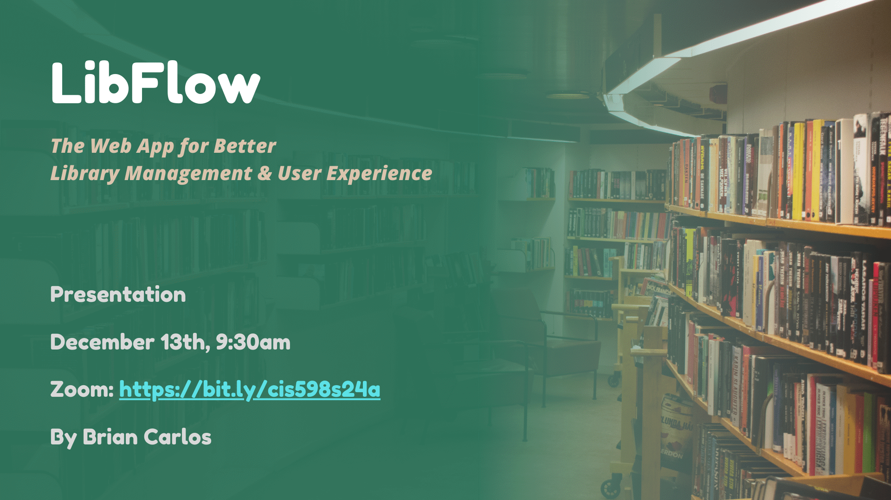
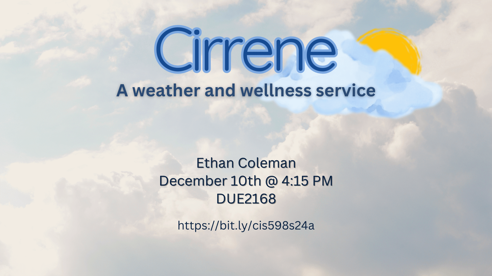

| Project | Student | Advisor | Date | Time | Location | Zoom |
|:-------:|:-------:|:-------:|:----:|:----:|:--------:|:----:|
| [LibFlow]({}) | Brian Carlos | Feldhausen | Mon, Dec. 9 | 9:30 AM | ONLINE | [Zoom](https://bit.ly/cis598s24a) |
| [Wildcat Offroad]({}) | John Nettles | Neilsen | Tue, Dec. 10 | 8:00 AM | DUE 2168 | [Zoom](https://bit.ly/cis598s24a) |
| [GrooveMapper]({}) | Sean Hackenberg | Feldhausen | Tue, Dec. 10 | 8:45 AM | DUE 2168 | [Zoom](https://bit.ly/cis598s24a) |
| [The Z-MAN Workout App]({}) | Zachary Wilson | Valenzuela | Tue, Dec. 10 | 9:30 AM | DUE 2168 | [Zoom](https://bit.ly/cis598s24a) |
| [BlockOut: Employee Scheduling Simplified]({}) | Alexander Valler | DeLoach | Tue, Dec. 10 | 10:15 AM | DUE 2168 | [Zoom](https://bit.ly/cis598s24a) |
| [Quick Closet]({}) | Ryan Stueve | Bean | Tue, Dec. 10 | 11:00 AM | DUE 2168 | [Zoom](https://bit.ly/cis598s24a) |
| [Map Mates]({}) | Matthew Cunningham | Bean | Tue, Dec. 10 | 11:45 AM | DUE 2168 | [Zoom](https://bit.ly/cis598s24a) |
| [DuelGames]({}) | Mason Vick | Feldhausen | Tue, Dec. 10 | 1:15 PM | DUE 2168 | [Zoom](https://bit.ly/cis598s24a) |
| [K-12 CS Lesson Planning]({}) | Wyatt Stella | Bean | Tue, Dec. 10 | 2:00 PM | DUE 2168 | [Zoom](https://bit.ly/cis598s24a) |
| [Proximity-Aware Spell Correction]({}) | Dennis Meyer | Thornton | Tue, Dec. 10 | 2:45 PM | DUE 2168 | [Zoom](https://bit.ly/cis598s24a) |
| [Tabletop Role-Playing Game Character Sheet Creator]({}) | Jackie Sadrakula | Bean | Tue, Dec. 10 | 3:30 PM | DUE 2168 | [Zoom](https://bit.ly/cis598s24a) |
| [Cirrene]({}) | Ethan Coleman | Weese | Tue, Dec. 10 | 4:15 PM | DUE 2168 | [Zoom](https://bit.ly/cis598s24a) |
| [Productivity App]({}) | Jadin O'Reillly | Feldhausen | Tue, Dec. 10 | 5:00 PM | ONLINE | [Zoom](https://bit.ly/cis598s24a) |
| [Equivalency Form Tracker]({}) | Kael Pavlik | Weese | Wed, Dec. 11 | 8:00 AM | DUE 2168 | [Zoom](https://bit.ly/cis598s24a) |
| [Project Title]({}) | Grant Eastman | Feldhausen | Wed, Dec. 11 | 8:45 AM | DUE 2168 | [Zoom](https://bit.ly/cis598s24a) |
| [Hidden Archive]({}) | Sicheng Chen | Bean | Wed, Dec. 11 | 9:30 AM | DUE 2168 | [Zoom](https://bit.ly/cis598s24a) |
| [Relevare]({}) | Naomi Harrison | Thornton | Wed, Dec. 11 | 10:15 AM | DUE 2168 | [Zoom](https://bit.ly/cis598s24a) |
| [Hacker's Day Out]({}) | Darius Tyson | Bean | Wed, Dec. 11 | 11:00 AM | DUE 2168 | [Zoom](https://bit.ly/cis598s24a) |
| [Parrot]({}) | Andrew Mejia | Shamir | Wed, Dec. 11 | 11:45 AM | DUE 2168 | [Zoom](https://bit.ly/cis598s24a) |
| [Scoobot]({}) | Jacob Prather | Weese | Wed, Dec. 11 | 1:15 PM | DUE 2168 | [Zoom](https://bit.ly/cis598s24a) |
| [GrapeVyne]({}) | Lucas Boice | Malallah | Wed, Dec. 11 | 2:00 PM | DUE 2168 | [Zoom](https://bit.ly/cis598s24a) |
| [Streamlink3D]({}) | Garrett Jones | Bean | Wed, Dec. 11 | 2:45 PM | DUE 2168 | [Zoom](https://bit.ly/cis598s24a) |
| [Smith House Managerial System]({}) | Aidan Beesley | Thornton | Wed, Dec. 11 | 3:30 PM | DUE 2168 | [Zoom](https://bit.ly/cis598s24a) |
| [4-H Fair Entry App]({}) | Matthew Hall | Feldhausen | Wed, Dec. 11 | 4:15 PM | DUE 2168 | [Zoom](https://bit.ly/cis598s24a) |
| [Wildcat Watershed]({}) | Logan Smith | Shamir | Wed, Dec. 11 | 5:00 PM | DUE 2168 | [Zoom](https://bit.ly/cis598s24a) |

## LibFlow {#e0}

Brian Carlos

LibFlow is a web-based library management system designed to simplify catalog management and enhance user experience. The application allows users to search for books, check their availability, and check out or return them through an intuitive interface. Librarians can manage the library's catalog by adding, editing, or removing books and overseeing user activity. Built with Vue.js, Node.js/Express, and MySQL, LibFlow offers a secure, reliable solution for libraries, delivering an intuitive experience for both patrons and staff.

## Wildcat Offroad {#e1}

John Nettles

The K State Baja SAE team, also known as Wildcat Offroad, needs a new dashboard for their car. Their current dashboard, while functional, is somewhat limited in its capabilities. Using a Teensyduino 4.1, it displays dashboard data like a car is expected to do as well as records data when prompted to do so, but the team has expressed desire for something better. Using a Raspberry Pi 3B, a new design should allow the Baja team to expand the capabilities of their car and how they interact with it. The project will be presented by John Nettles at 8 AM on Tuesday, December 10th in DUE 2168 or on Zoom at https://bit.ly/cis598s24a

## GrooveMapper {#e2}

Sean Hackenberg

GrooveMapper is a web application for exploring Spotify music data. GrooveMapper can be used for finding connections between artists and finding new music recommendations. These connections and recommendations are powered by a Neo4j graph database. The data for this project was downloaded using the Spotify API and then organized into a graph structure. This project is coded in python using the python neo4j driver to interact with the graph database and uses pyvis (a graph data visualization package) to visualize the queries on a simple flask interface. This project was created by Sean Hackenberg and is going to be presented on Tuesday, December 10th in DUE 2168 at 8:45 AM. You can watch this presentation through zoom using this link: https://bit.ly/cis598s24a.

## The Z-MAN Workout App {#e3}

Zachary Wilson

Z-MAN Workout App is an open-source full-stack application designed for gym environments. It aims to simplify the process of creating and tracking workouts while offering advanced features such as workout analysis. The application serves as a demonstration of the engineering skills I developed during my time at Kansas State University and through various internship experiences. It is built using React Native for the front-end interface and integrates with a C# API for efficient user data storage and retrieval. I, Zachary Wilson, will be presenting Z-MAN Workout App on Tuesday, December 10th at 9:30 AM in DUE 2168 or via Zoom. bit.ly/cis598s24a

## BlockOut: Employee Scheduling Simplified {#e4}

Alexander Valler

Managing employee schedules can be a time-consuming challenge for business owners and managers. BlockOut is a web-based employee scheduling platform designed to streamline the creation and management of business schedules. Built using ASP.NET Razor Pages, a MySQL database, and hosted on DigitalOcean, BlockOut empowers businesses to generate and customize schedules efficiently. The platform includes features such as real-time calendar previews, automated scheduling based on employee availability and preferences, and role-based access control for managers, owners, and employees. BlockOut provides a scalable and user-friendly solution for small to medium-sized businesses seeking to simplify their scheduling processes.

## Quick Closet {#e5}

Ryan Stueve

People often struggle figuring out what to wear when going out, or when getting ready in the morning. Quick Closet is a web application made to help solve this problem. Users are able to upload photos of all the clothing items in their wardrobe to this application. This allows users to construct their own outfits and save them for later. The real functionality of this application comes from the ability to have outfits generated for the user. Using rules engine technology allows for the ability for good outfits to be made! The Quick Closet project is made by Ryan Stueve and will be presented Tuesday, December 10th at 11:00am in DUE 2168 and on this link bit.ly/cis598s24a.

## Map Mates {#e6}

Matthew Cunningham

Map Mates is a revised web application that allows users to catalog and rate the places they’ve visited to share amongst in-app friends. The platform highlights the recent activity of connected users and provides user specific recommendations of places to visit/try. The primary goal of this application is to allow users to build a trusted network of individuals, so that reviews of new locations come from a reliable source. Map Mates is built using Vue.js, Node, and Neo4J. The presentation will be given on Dec. 10th at 11:45 am in DUE 2168 or can viewed online at bit.ly/cis598s24a.

## DuelGames {#e7}

Mason Vick

Abstract

## K-12 CS Lesson Planning {#e8}

Wyatt Stella

K-12 CS Lesson Planning is a MAUI desktop application that enables CS teachers to create their lesson plans and link them with Kansas’ K-12 Computer Science standards. Its goal is to have a single place where teachers can create, order, and access their lesson plans on a local SQLite database. With CS Lesson Planning, teachers can spend less time shuffling around standard documentation and spend more time on the content of their lessons.

## Proximity-Aware Spell Correction {#e9}

Dennis Meyer

Proximity-Aware Spell Correction (PASC) is a C# library serving as a spell check algorithm. The driving idea for PASC is that cellphone typed phrases are riddled with misclicks and misclicks are generally adjacent or physically close to the intended target. PASC utilizes a modification of the Levenshtein Distance algorithm, where character substitutions are substantially cheaper if they are physically close to each other. This provides a spell check software that can be implemented inside other programs to suggest replacements to misclicks – as well as standard misspellings. Dennis Meyer will be presenting Proximity-Aware Spell Correction in DUE 2168 on Tuesday December 10,at 2:45 PM. The presentation will be broadcast on zoom at: bit.ly/cis598s24a

## Tabletop Role-Playing Game Character Sheet Creator {#e10}

Jackie Sadrakula

Tabletop Role-Playing Game Character Sheet Creator (TTRPG CSC) is a web application designed with the idea of giving the user full control in designing and organizing character sheets. Once signed up or logged in to this web app, users can create sheets, characters, and modify both as needed. Rules can be added to elements in a sheet to automatically calculate certain values as needed. TTPRG CSC is made primarily using Blazor and Google Firebase, utilizing C#, JavaScript, and HTML/CSS. The project will be presented on Tuesday, December 10th at 3:30 PM in DUE 2168 or on Zoom at https://bit.ly/cis598s24a.

## Cirrene {#e11}

Ethan Coleman

Research has shown that weather, particularly seasonal trends can have a significant impact on your mood and mental wellbeing. However, this connection can be hard to notice amid everything one has to do in a day. Cirrene is a website, powered by Python Flask, that allows you to track your mood and wellbeing as it relates to weather, gain insights about your own patterns, and learn about strategies to combat weather-related stress. The service is also intended, in this process, to encourage greater mindfulness about one’s mood and wellbeing generally.

## Productivity App {#e24}

Jadin O'Reilly

I want to be more productive and stay off my phone. My goal is to make a mobile application that I can use to track habits and daily tasks. Users are able to create tasks and edit them to reoccur over different days and weeks. You go to the next page and can track your task history and on the next page you'll have a profile page for you to edit.I created a mobile application using Java Script and React Native. Firebase is doing a lot of the backend work. All the data is stored in Firebase’s Firestone. The authentication is done by Firebase Authentication. Mobile app notifications are done by Firebase Cloud Messaging. I have been testing this application out by using Expo’s mobile phone simulator and Jest, a JavaScript testing library.

## Equivalency Form Tracker {#e12}

Kael Pavlik

Equivalency Form Tracker is a Web Application that organizes course transfer requests and course evaluations for the Computer Science department. On the app, students are able to submit all necessary paperwork and communicate directly to staff for information rather than by email. To turn this idea into a reality, a crud app pattern is used with Vue.js for the front end, and NodeJS and MySQL on the backend. The presentation is December 11, 8 AM in DUE 2168 or online through zoom (bit.ly/cis598s24a).

## Project Title {#e13}

Grant Eastman

Abstract

## Hidden Archive {#e14}

Sicheng Chen

Hidden Archive is a web application tailored to Dungeon Masters (DMs) to efficiently manage and organize their written documents for Dungeons & Dragons (D&D) campaigns. It stores various resources such as campaign notes, NPC profiles, and adventure logs, providing a smooth user experience for DMs to access and modify materials. Key features of Hidden Archive include document categorization, full text search functionality, document distribution of files to players, and customizable templates for creating new content.

## Relevare {#e15}

Naomi Harrison

Relevare (derived from the Latin word meaning "to help") is a spring-cleaning app designed to assist users in gaining valuable insight into their wardrobe habits. It allows users to remotely access their closet, track when they last wore each item, and identify pieces they haven’t worn in a while. Additionally, Relevare promotes sustainable fashion by suggesting nearby donation or resale locations for unused clothes. Built with .NET Maui, C#, and MySQL, Relevare offers a flexible, environmentally conscious platform that can easily expand to support tracking of new types of items in the future. This will be presented by Naomi Harrison and takes place on December 11th at 10:15am in room DUE 2168 of the Engineering Hall and on Zoom at https://bit.ly/cis598s24a.

## Hacker's Day Out {#e16}

Darius Tyson

Hacker’s Day Out is a video game made in C# using the MonoGame API designed to teach the basics of various computer science languages and concepts to people new to the field. You play as a nameless student, hacking his way to the yearbook editing room to replace an embarrassing photo taken. You must explore the school, collect notebooks, and test your knowledge against the computer systems in order to get into the yearbook editing room. Will you be able to fix your photo, or will you have a bad time at graduation?

## Parrot {#e17}

Andrew Mejia

PARROT is an LLM-powered synthetic data generation platform built on the following technology stack: Vue.js for a component based front-end interface, Flask for the API request handling, and a Python backend that utilizes the power of pretrained Large Language Models. PARROT will be aiming to create and output large volumes of realistic, user-customized data for both software testing and AI model training applications. The Vue.js frontend provides an interface for user defined data structures and relationships, while the Flask API handles the data flow between the user interface and the Python generation engine. PARROT’s backend utilizes pre-trained LLMs to ensure synthetic data outputs in a realistic and consistent way, which can often be difficult to find in real datasets. The software will export the generated data in multiple formats (XML, JSON, CSV), making it useful for applications in enterprise software testing, AI model training, and any scenario where realistic and consistent test data is necessary. This full-stack project will greatly reduce test data preparation work while ensuring data integrity.

## Scoobot {#e18}

Jacob Prather

Join Jacob Prather for a presentation on Scoobot: A Dynamic Chatbot for University Information on December 11th at 1:15 PM, located in DUE 2168. Scoobot is a versatile chatbot designed to assist students and staff by providing information about various university departments, faculty, courses, events, and more. Built using technologies such as Python, Flask, Rasa, PostgreSQL, and Natural Language Processing, Scoobot dynamically responds to queries and provides a seamless user experience. The presentation will cover the development, architecture, and key features of Scoobot, showcasing how it can be customized for different institutions. Don't miss the opportunity to learn more about the future of chatbots in educational settings. Join via Zoom: https://bit.ly/cis598s24a

## GrapeVyne {#e19}

Lucas Boice

GrapeVyne is a mobile application to aid and assist with day-to-day childcare for parents. It assists parents by allowing for the tracking of real-time data and developmental milestones. GrapeVyne also allows parents to add guardians as a community to keep up with the child’s growth. The application is built using Expo, the React-Native framework, Google’s Firebase, and is written in JavaScript. It is meant to be a lightweight and simple application to empower parents in the modern era. The presentation for GrapeVyne will be held in room DUE 2168 on Wednesday December 11th, 2024, at 2:00pm. The event will also be streamed live on zoom at the same time for distance viewers at this link: https://ksu.zoom.us/j/97743340894?pwd=MEVrZHVxN25vcGhoaXh0Tzg4YzlSZz09 .

## Streamlink3D {#e20}

Garrett Jones

Using Maui for application design and C# for the code base, Streamlink3D is a desktop application meant to act as a hub for the many applications and websites that a 3D printing creator could want or need, allowing for a direct and personalized method of housing website links and application paths that the user works with most often in their design processes. I, Garrett Jones, will be presenting this project on December 11th at 2:45PM in DUE 2168 and it will be streamed using Zoom at bit.ly/cis598s24a

## Smith House Managerial System {#e21}

Aidan Beesley

Maitland E. Smith Scholarship House is an off-campus living environment based on the cooperation of all its members. As a part of this, one member is hired each year to serve as the House Manager, who is responsible for the upkeep of Smith House. After serving in that role last year, I thought I could use my computer science skills to improve the efficiency of the role with my Smith House Managerial System. The SHMS is built on a Blazor web front end with a SQL and C# backend for holding and communicating data. With the SHMS, next year’s House Manager will be able to much easier track what products have been used with the data input form and usage trend graphs, as well as being able to automatically send orders for more out with an email bot. With the time saved by this system, the House Manager will be able to spend more time on the academics that got them into Smith House and just enjoy being a student on our wonderful campus. This project will be presented by myself, Aidan Beesley, on December 11th at 3:30pm in DUE 2168, or on Zoom at https://bit.ly/cis598s24a.

## 4-H Fair Entry App {#e22}

Matthew Hall

Abstract

## Wildcat Watershed {#e23}

Logan Smith

This project is purposed to assist a multi-disciplinary, multi-institutional research team in the furtherance of the knowledge and stewardship of fresh water by implementing a dashboard web application granting local residents in particular, public access to information regarding the health and status of their “backyard” watershed i.e., Wildcat Creek. The Wildcat Creek watershed is to serve as an experimental test-site at which an environmental monitoring system is to be deployed. My specific role in this is to deploy its corresponding public dashboard. This public-facing dashboard coupled with resident surveys and interviews will allow the research team to better understand the influence of enhanced native habitat visibility. The overarching aim of the group is to engage the public in the implementation of a network of “living laboratories” in various watersheds in the US Great Plains region. Due to the requirements of the research team—that the Wildcat Creek site be experimental and its dashboard public- facing—I chose to implement this application using Plotly’s Dash framework, which allows programmers to code analytic data apps and interactive dashboards. Because it can be used for almost all phases of the data analysis process it seemed to be especially well-suited for these requirements. Dash uses Flask for the backend, Plotly for producing plots, and React to handle all components. It provides HTML elements as Python classes (converting Python to HTML) in addition to providing a few other packages (Dash Core Components, Dash Bootstrap Components) that enhance its functionality while keeping the language constant.

