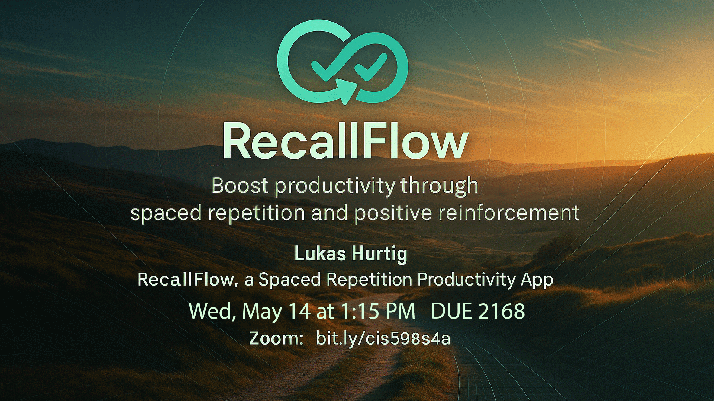
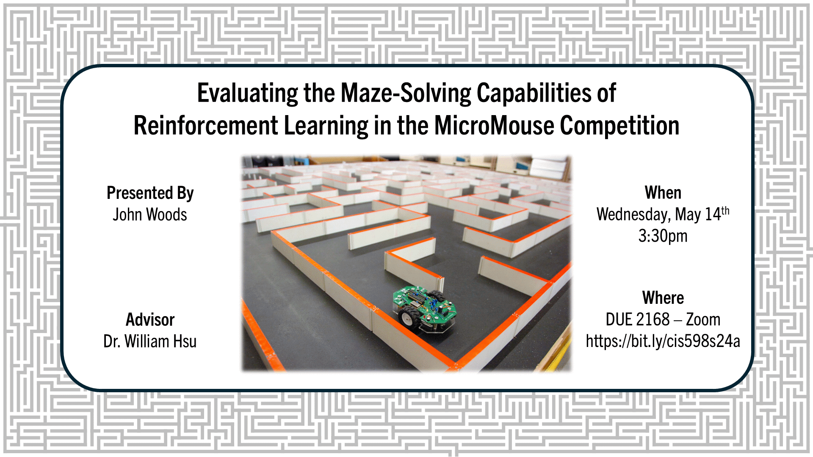

| Project | Student | Advisor | Date | Time | Location | Zoom |
|:-------:|:-------:|:-------:|:----:|:----:|:--------:|:----:|
| [GarageMate]({}) | Sam Wilson | Weese | Tue, May 13 | 8:00 AM | DUE 2168 | [Zoom](https://bit.ly/cis598s24a) |
| [After Hours]({}) | Kyle Zeller | Feldhausen | Tue, May 13 | 8:45 AM | DUE 2168 | [Zoom](https://bit.ly/cis598s24a) |
| [Eat-Seats]({}) | Dawson Stutzman | Bean | Tue, May 13 | 9:30 AM | DUE 2168 | [Zoom](https://bit.ly/cis598s24a) |
| [Another Voxel Engine]({}) | Cameron Pilchard | Feldhausen | Tue, May 13 | 10:15 AM | DUE 2168 | [Zoom](https://bit.ly/cis598s24a) |
| [PeakTri]({}) | Sage Cauley | Feldhausen | Tue, May 13 | 11:00 AM | DUE 2168 | [Zoom](https://bit.ly/cis598s24a) |
| [Superorganism]({}) | Jiwoo Jung | DeLoach | Tue, May 13 | 11:45 AM | DUE 2168 | [Zoom](https://bit.ly/cis598s24a) |
| [Only In My Head]({}) | Keenan Melton | Bean | Tue, May 13 | 1:15 PM | DUE 2168 | [Zoom](https://bit.ly/cis598s24a) |
| [RollScape]({}) | Samuel Allred | Bean | Tue, May 13 | 2:00 PM | DUE 2168 | [Zoom](https://bit.ly/cis598s24a) |
| [MTG DND Card Cost Calculator]({}) | Camden Green | Bean | Tue, May 13 | 2:45 PM | DUE 2168 | [Zoom](https://bit.ly/cis598s24a) |
| [SightSeer Interactive Mapping]({}) | Gabriel McReynolds | Valenzuela | Tue, May 13 | 3:30 PM | DUE 2168 | [Zoom](https://bit.ly/cis598s24a) |
| [SwiftMail]({}) | Caleb Chan | Thornton | Tue, May 13 | 4:15 PM | DUE 2168 | [Zoom](https://bit.ly/cis598s24a) |
| [McToStl]({}) | Wyatt Smith | DeLoach | Wed, May 14 | 8:00 AM | DUE 2168 | [Zoom](https://bit.ly/cis598s24a) |
| [Title]({}) | Tushar Lanka | Neilsen | Wed, May 14 | 8:45 AM | DUE 2168 | [Zoom](https://bit.ly/cis598s24a) |
| [SimTrade]({}) | Vinny Sun | Weese | Wed, May 14 | 9:30 AM | DUE 2168 | [Zoom](https://bit.ly/cis598s24a) |
| [Screen Savior]({}) | Caleb Kmiecik | Shamir | Wed, May 14 | 9:30 AM | **DUE 2183** | **[Zoom](https://bit.ly/cis598s24b)** |
| [Potion Match]({}) | Maxwell Shafer | Bean | Wed, May 14 | 10:15 AM | DUE 2168 | [Zoom](https://bit.ly/cis598s24a) |
| [Escaplore]({}) | Sak Lee | Neilsen | Wed, May 14 | 11:00 AM | DUE 2168 | [Zoom](https://bit.ly/cis598s24a) |
| [Puzzle Mate]({}) | Kyle Kohman | Thornton | Wed, May 14 | 11:45 AM | DUE 2168 | [Zoom](https://bit.ly/cis598s24a) |
| [RecallFlow]({}) | Lukas Hurtig | Feldhausen | Wed, May 14 | 1:15 PM | DUE 2168 | [Zoom](https://bit.ly/cis598s24a) |
| [DataDunk]({}) | Isaac Steiner | Valenzuela | Wed, May 14 | 2:00 PM | DUE 2168 | [Zoom](https://bit.ly/cis598s24a) |
| [Fredbear and Friends: Arcade]({}) | Bryan Gross | Bean | Wed, May 14 | 2:45 PM | DUE 2168 | [Zoom](https://bit.ly/cis598s24a) |
| [MicroMouse Maze Solving]({}) | John Woods | Hsu | Wed, May 14 | 3:30 PM | DUE 2168 | [Zoom](https://bit.ly/cis598s24a) |
| [The Fridge]({}) | Alex Harper | Feldhausen | Wed, May 14 | 4:15 PM | DUE 2168 | [Zoom](https://bit.ly/cis598s24a) |
| [Pickelball Planner]({}) | Dylan Rosquist | Valenzuela | Thur, May 15 | 8:00 AM | DUE 2168 | [Zoom](https://bit.ly/cis598s24a) |
| [Desmos Clone]({}) | Kael Pavlik | DeLoach | Thur, May 15 | 8:45 AM | DUE 2168 | [Zoom](https://bit.ly/cis598s24a) |
| [DiscMate]({}) | Moises Villegas | Valenzuela | Thur, May 15 | 9:30 AM | DUE 2168 | [Zoom](https://bit.ly/cis598s24a) |
| [Local Concert]({}) | Tatenda Sekabanja | Malallah | Thur, May 15 | 10:15 AM | DUE 2168 | [Zoom](https://bit.ly/cis598s24a) |
| [WorkAlert]({}) | Clint McKenzie & Logan Arnold | Feldhausen | Thur, May 15 | 11:00 AM | DUE 2168 | [Zoom](https://bit.ly/cis598s24a) |
| [Title]({}) | Pedro Mendez-Alcantar | Feldhausen | Thur, May 15 | 1:15 PM | DUE 2168 | [Zoom](https://bit.ly/cis598s24a) |
| [Macro Motive]({}) | Matthew Lund | Feldhausen | Thur, May 15 | 2:00 PM | DUE 2168 | [Zoom](https://bit.ly/cis598s24a) |
| [McKain]({}) | Aaron McKain | Thornton | Thur, May 15 | 2:45 PM | DUE 2168 | [Zoom](https://bit.ly/cis598s24a) |
| [Penguin Physics]({}) | Thomas Rosebrook | Bean | Thur, May 15 | 3:30 PM | DUE 2168 | [Zoom](https://bit.ly/cis598s24a) |

## GarageMate {#e1}

Sam Wilson

GarageMate is a web application designed for responsible car owners that aims to simplify two critical aspects of vehicle ownership: (1) Service Records, and (2) Maintenance Information. The platform provides a centralized interface for users to record the service history of their vehicle, and the ability to plan upcoming maintenance and costs. What sets GarageMate apart is its schedule optimization that uses a dynamic programming approach to minimize the cost and time spent on maintenance and it's at-a-glance dashboard to help owners visualize upcoming maintenance for their vehicle. Built with Django for scalability and extensive third-party library support, and Docker for portability and cross-platform compatibility, GarageMate offers both a self-hosted and cloud-based solution for all things vehicle maintenance. Future plans include providing the vehicle information as a public API, and adding more automation to the information gathering process. Sam Wilson will be presenting GarageMate on Tuesday, May 13th, at 8:00 AM in DUE 2168 (Zoom: https://ksu.zoom.us/j/97743340894?pwd=MEVrZHVxN25vcGhoaXh0Tzg4YzlSZz09).

## After Hours {#e2}

Kyle Zeller

Campus event advertising is fragmented across flyers, emails, and social media, leading to low attendance and missed opportunities for student engagement. After Hours, by Kyle Zeller, solves this by consolidating all campus and local business event announcements in to a single, easy-to-navigate platform that ensures students never miss a club meeting, sports game, or social gathering. Join the presentation on Tuesday, May 13 at 8:45 AM in DUE 2168 or online via Zoom: https://bit.ly/cis598s24a. 

## Eat-Seats {#e3}

Dawson Stutzman

Restaurant seating can change as frequently as holidays and special events come and go. Eat-seats aims to provide a simple drag and drop floor plan editor and seating management tool to fix these issues. Users can quickly create locations, swap between them, or manage permissions of employees at their restaurant. This NodeJS based progressive web app continues to work after losing internet connection with offline caching. The project will be presented on Tuesday, May 13th at 9:30 AM, by Dawson Stutzman in DUE 2168. It will also be available on Zoom: bit.ly/cis598s24a.

## Another Voxel Engine {#e4}

Cameron Pilchard

AVE is a Minecraft-inspired voxel game engine developed in C++ using SDL3 and OpenGL. This project demonstrates an understanding of advanced graphics programming, memory management, and real-time systems. Key features include Simplex noise procedural terrain generation using FastNoise2, multithreaded chunk loading, frustum culling, swept AABB collision detections, and compressed vertex buffers. Other features include MSDF font rendering and ambient occlusion. As a game engine, the project also supports user interaction with a simulated 3D voxel world. All external libraries are assembled using the vcpkg package manager, and the project is built using CMake for modularity and cross-platform support.

## PeakTri {#e5}

Sage Cauley

PeakTri is a training focused mobile application developed using react-native, expo, firebase, and ChatGPT, designed to help athletes plan and track their swim, bike, and run workouts. The goal of this app is to simplify the triathlon training process by allowing users to build custom workouts, review completed workouts, and visualize their performance over time. By leveraging ChatGPT, PeakTri generates personalized workouts that support both seasoned and aspiring triathletes making the training process more accessible.

## Superorganism {#e6}

Jiwoo Jung

Superorganism is a 2D colony management platformer that blends survival mechanics with ecological simulation, inspired by games like SimAnt and Terraria. Designed as both a gameplay experience and a biology-informed simulation, the project explores population genetics and adaptive behaviors in ant colonies. Built with the MonoGame framework, it features AI-driven worker behavior, procedural terrain, real-time resource dynamics, and a responsive environment. Key technologies include A* pathfinding, flocking AI, tile-based collision detection, and a dynamic workforce allocation system that evolves based on colony needs. This project aims to demonstrate the complex interplay between environmental challenges and emergent behaviors in simulated ecosystems.

## Only In My Head {#e7}

Keenan Melton

Only in my Head is an RPG built in the MonoGame framework with C#, made by Keenan Melton. This game's unique feature is the real-time reflection of the character's mental health condition. The player’s choices in game dynamically affects the colors, dialogue, combat, and font styles. The purpose of the game is to help spread awareness of mental health and the effects it can have on people. Come attend my presentation to see my game in DUE 2168 on Tuesday, May 13th at 1:15PM! 

## RollScape {#e8}

Samuel Allred

RollScape is an interactive 3D game developed in C# using the MonoGame framework where players control a ball across procedurally generated terrain using the Wiimote's motion-sensing capabilities. The game uses heightmap algorithms to create custom landscapes that players navigate using gyroscopic controls, providing an immersive physics-based gameplay experience, including a coin-based shop progression system. The project implements its own camera system, collision detection, physics, and state management to deliver a complete experience demonstrating a practical application of motion control technology in modern game development.

## MTG DND Card Cost Calculator {#e9}

Camden Green

Me and my friends created a custom set of rules to "cost" Magic: The Gathering cards for use in a Dungeons & Dragons campaign. The rules are a list of ~100 conditionals and criteria that based on factors like the cards type and mana cost determine a point total you have to pay to acquire that card. This process gets tedious as this is something that needs to be done weekly to an average of ~20 cards. My single page React web app utilizes JSON rules engine as a way to translate the rules into an algorithm while making them very easy to add/remove/modify if changes are made. Not all of the rules are easily implementable and some are impossible to fully complete, so users are also given components to manually modify it themselves if needed.

## SightSeer Interactive Mapping {#e10}

Gabriel McReynolds

SSIM (SightSeer Interactive Mapping) is a desktop application project built with Flutter to automate the creation of interactive maps for the SightSeer Tour app. This tool will take geographic data, visualize it for graphic designers on a map, and then georeference the resulting image for use in the SightSeer Tour app. SSIM will automate the current manual process of uploading GeoJSON data, manually georeferencing images, and uploading raster tiles and MBTiles databases to Google Cloud. Key algorithmic functionalities include converting PostGIS data into a visual representation and preparing data for the GDAL command line tool for Google Cloud upload. Features include the ability to upload an image for georeferencing, generate raster tiles and MBTiles databases, visualize business geo-data, set map boundaries, display coordinates, displaying artifacts, upload generated files to Google Cloud, and allow user login via the SightSeer API.

## SwiftMail {#e11}

Caleb Chan

With the goal to help users handle and reply to emails more effectively, this project presents a web application called "SwiftMail," which makes use of artificial intelligence. Constructed with React, FastAPI, the Gmail API, and OpenAI's GPT model, the assistant recognizes marketing material, prioritizes emails, highlights messages that require a response, and recommends or automatically creates appropriate responses. The solution uses machine learning to increase user productivity in high-volume inboxes and securely authenticates with Google via OAuth2. The technological architecture, AI integration, and essential features of the assistant will all be covered in this presentation.

## McToStl {#e12}

Wyatt Smith

My project takes structures built in the game Minecraft and converts them into a 3D model in the STL format, allowing for tasks such as 3D printing of objects made in- game. The key challenges in this project involve eliminating impossible geometry features and optimizing the output file size, while also scaling efficiently to large inputs. The project is made in Java and the UI in javafx.

## Project Name {#e13}

Tushar Lanka

Abstract

## SimTrade {#e14}

Vinny Sun

SimTrade is a full-stack web-based stock trading and algorithm backtesting application. Users are given virtual capital to trade over 150 stocks both in real time and with over 10 years of historical data. The application also supports running automatic backtests of well-known trading algorithms. This application is helpful for both novice traders wanting a risk-free introduction to the market and experienced traders wanting to test personal trading strategies. The application is built with PostgreSQL, Django + Django REST Framework, and Vue + PrimeVue. The project will be presented on Wednesday, May 14 at 9:30 in DUE 2168 or at https://ksu.zoom.us/j/97743340894?pwd=MEVrZHVxN25vcGhoaXh0Tzg4YzlSZz09.

## Screen Savior {#e33}

Caleb Kmiecik

Caleb Kmiecik presents Screen Savior, an Android application designed to help users regain control over their digital habits. The app observes smartphone usage patterns using Android's UsageStatsManager and employs a custom rule engine to identify potentially problematic habits. Based on these insights, it prescribes targeted, customizable intervention strategies (such as timed greyscale filtering or application timers) to reduce unwanted screen time while preserving essential functionality. Built natively using Kotlin and Jetpack Compose for the UI, Screen Savior utilizes Android Room for local data persistence, WorkManager for reliable background data aggregation, and leverages Kotlin Coroutines with StateFlow for managing asynchronous operations and UI state. Suggested strategies are thoughtfully designed, customizable, and monitored for efficacy over time, offering users powerful usage overview tools and progress tracking. The final presentation will be held on Wednesday, May 14th, 2025, at 9:30 AM in DUE 2183. Join via Zoom: https://bit.ly/cis598s24b

## Potion Match {#e15}

Maxwell Shafer

Potion Match is a match-making puzzle strategy game. The objective is to match similarly colored clouds in unique patterns to clear them from the screen. Don’t let the room fill with clouds, or you won't be able to continue playing! You’re able to move and rotate clouds as they float up to the top of the room, where you can strategically place them in a Tetris-like fashion to make those matches. With your successful matches, you earn a currency which you can reinvest into your potion-making venture by unlocking more ingredients, special powers, and upgrades, improving your match values! Potion Match is built fully using Godot 4.4 and written in GDScript. All images were drawn on Procreate on the Apple iPad! All asset and game development was completed by Max Shafer. A live demo will be held in DUE 2168 on Wednesday, May 14th, @ 10:15 in DUE 2168. Or join by Zoom: https://ksu.zoom.us/j/97743340894?pwd=MEVrZHVxN25vcGhoaXh0Tzg4YzlSZz09

## Escaplore {#e16}

Sak Lee

Ever since my first encounter with a computer game, I have long desired to develop a game that I have personally designed. This passion has driven me to pursue a degree in Computer Science at Kansas State University, even though I had no prior knowledge in programming. With all the programming knowledge and experiences that I have acquired as a K-State student, I decided to realize my old desire by designing and developing a game for my CIS 598 project. Escaplore is a game that I have personally designed, a dice-roll-based game of mixed-genre, where the players explore an island to escape it. The game title, Escaplore, is a blend of ‘escape’ and ‘explore,’ reflecting the core of the gameplay. Utilizing C# language with Godot Engine, and Visual Studio, I have structured the game under Scene-Tree architecture, in which, the program is formed through a tree of scenes, or in other words, tree of saved states of objects. Together with the implementation of the concept of object-oriented and layered design, I have developed a game that I could call my own. Escaplore is both a fulfillment of my long dream, and a culmination of my academic journey.

## Puzzle Mate {#e17}

Kyle Kohman

Puzzle Mate is a MAUI-based application designed to help chess players refine their skills by practicing position-specific puzzles tailored to their gameplay. Leveraging both the Chess.com and Stockfish APIs, the application analyzes a user's recent games to generate puzzles relevant to their strategic development. Additionally, a custom algorithm assigns interest scores to various chess positions, ensuring that users engage with the most impactful scenarios for improving their performance. The algorithm evaluates factors such as tactical potential, pawn structure, material advantage, and position type to determine which positions are most valuable for the player's growth. This presentation, delivered by Kyle Kohman, will take place on Wednesday, May 17th at 11:45 AM in room DUE 2168.

## RecallFlow {#e18}

Lukas Hurtig

RecallFlow is a minimalist productivity app designed to help users build consistency, maintain momentum, and pursue meaningful goals through the combined power of spaced repetition and positive reinforcement. Unlike traditional to-do lists that often lead to overwhelm or stagnation, RecallFlow delivers smart, dynamic task recommendations tailored to each user’s preferred challenge level and goal structure. By integrating intuitive customization options, such as setting the number of active goals or limiting the number of daily tasks shown, the app supports a balanced and sustainable approach to productivity. The clean interface emphasizes clarity and progress without clutter, while features like a streak tracker offer motivational feedback. This project was created by Lukas Hurtig and is going to be presented Wednesday, May 14 at 1:15PM DUE 2168. You can watch this presentation through zoom using the following link: https://bit.ly/cis598s24a.

## DataDunk {#e19}

Isaac Steiner

DataDunk is a full-stack sports analytics web application designed to help users research NBA player performance and identify trends. The app combines a React frontend with an Express.js backend and a PostgreSQL database to display player stats, game logs, and probability scores for stat predictions. Using machine learning, DataDunk estimates the likelihood that a player will exceed user-defined thresholds for stats like points, rebounds, or assists. The application showcases how modern web technologies and real-time data analysis can assist sports bettors and fans alike. Isaac Steiner will present DataDunk on Wednesday, May 14th at 2:00pm in DUE 2168 or online at https://bit.ly/cis598s24a.

## Fredbear and Friends: Arcade {#e20}

Bryan Gross

Fredbear and Friends: Arcade is a 2D minigame collection with a mysterious story to uncover in the hallowed halls of the game world. Play fun and diverse minigames to uncover the secrets behind the Fazbear corporation's latest attempt to break into relevance again after the tragedies of the past. Minigames include luck based affairs, duck picking, fishing, and so much more fun fun fun to be have. This project is made using the Monogame/XNA Framework with the C# coding language powering it. To uncover the secrets of the past tune in at 2:45 PM Wednesday, May 14 in DUE 2168 or on Zoom at https://bit.ly/cis598s24a presented and developed by Bryan Gross.

## MicroMouse Maze Solving {#e21}

#### Evaluating the Maze-Solving Capabilities of Reinforcement Learning in the MicroMouse Competition

John Woods

The MicroMouse Competition is a robotics competition where fully autonomous robots are tasked with navigating a maze in the shortest possible time. Creating an effective robot requires not only clever hardware design, but also intelligent and efficient software design. In this project, I will be evaluating the application of Reinforcement Learning (RL), a subfield of Machine Learning in which an autonomous agent learns to make decisions in its environment, for solving the maze in this competition. To do so, I developed a custom simulation environment using the Gymnasium Python library to evaluate the performance of RL algorithms from the Stable Baselines 3 library. In addition, I also implemented several traditional graph-based maze-solving algorithms to serve as a baseline comparison. John Woods will be presenting the results on Wednesday, May 14th, 2025, at 3:30pm in DUE 2168 and on Zoom at https://bit.ly/cis598s24a.

## The Fridge {#e22}

Alex Harper

My name is Alex Harper, and the project I did is called The Fridge. This project is a Django web application used to keep track of food items in your household. It will notify the user if any of their food items are about to expire, and has some functionality based on that such as suggesting shopping lists and notifying users of food that is about to expire. This application will help users keep track of what is in their fridge without having to go through every single item, saving them time and effort. This presentation will be happening on Wednesday, May 14 at 4:15 PM in DUE 2168.

## Pickelball Planner {#e23}

Dylan Rosquist

The Pickleball Planner is a web-based application designed to streamline the organization and management of local pickleball events. Traditionally, managing local tournaments and events has relied heavily on paper and the monitoring of a single individual which could lead to gaps in data or errors in scoring. The Pickleball Planner addresses these challenges by providing a single platform for tracking player, team, and league stats and records, while also offering an automated game scheduling algorithm that provides an easy way to get tournament games scheduled without having to do any complex math. By bringing this process online, the Pickleball Planner ensures that all information is easily accessible, stored securely, and organized efficiently, making planning tournaments faster, more reliable and scales with size. The presentation will be on May 15, 8:00 a.m. Location DUE 2168 and Zoom link: bit.ly/cis598s24a.

## Desmos Clone {#e24}

Kael Pavlik

This project is designed to aid developers with developing large mathematical formulas with code by cloning a graphing website desmos.com with extra features that are useful for software development. With this project, developers are able to write formulas in a readable format, and study a visual graph to verify a formula. Then, by applying an algorithm that can translate math formulas into various coding languages, developers may use verified and documented code seamlessly into their projects. By allowing this software to take mathematical formulas and display the context of the formulas, the burden of learning math while coding may be less daunting.

## DiscMate {#e25}

Moises Villegas

DiscMate is a web-based disc golf app that helps players track performance, visualize gameplay, and improve their strategy. Built with React, the GoogleMaps API, Spring Boot, and PostgreSQL, it lets users log rounds, record hole-by-hole scores, and explore interactive course maps with tee pads and baskets. Players can view recommended shots, track stats over time, and analyze progress through historical data, offering a streamlined experience for all skill levels. This will be presented by Moises Villegas in DUE2168 on Thursday, May 15th at 9:30AM, or can be viewed on zoom through this link: https://bit.ly/cis598s24a

## Local Concert {#e26}

Tatenda Sekabanja

Local Concert helps independent and hobbyist musicians who often lack the time and resources to promote their live performances. The platform is a CRUD- based web application that helps local artists publicize their events with minimal effort. Once they register, they can integrate with Stripe to process ticket sales and payments. The app uses a React front-end, Redux Toolkit for state management, and a Node.js/Express backend connected to a SQLServer database. It also makes use of the Stripe API, AWS sdk, and google maps API.

## WorkAlert {#e27}

Clint McKenzie & Logan Arnold

When people think of dangerous jobs, they often think of professions such as a police officer or firefighter that run towards the signs of danger on a daily basis. While these jobs are obviously dangerous, people often don’t think of the dangers of everyday jobs. But professions like caretakers, housekeepers, or home renovators can statistically be just as dangerous due to the chaotic nature of entering somebody else’s home. While other professions have safety equipment to keep employees as safe as possible, service workers require other needs in order to keep them safe. Hence why we created our android mobile application, WorkAlert. The purpose of the app is to allow people who work in potentially dangerous environments, like random people’s homes, to automatically contact their emergency contacts in the event of an emergency.

## Project Name {#e29}

Pedro Mendez-Alcantar

Abstract

## Macro Motive {#e30}

Matthew Lund

Macro Motive is a fitness and nutrition tracking application developed using TypeScript with React and Expo Go. Designed to streamline the process of monitoring meals and workouts, the app features a user-friendly interface where individuals can log daily activities and track their progress. A standout feature of Macro Motive is its integration of a natural language processing API that translates everyday English descriptions of meals into detailed nutritional data. Users can save frequently consumed meals to a personal library for quick reuse. Additionally, the app offers a workout library that enables users to store and repeat their favorite exercise routines. Overall, the app focuses on streamlining progress-tracking and taking as much effort off the user as possible while keeping them on track towards their fitness goals.

## Hearth {#e31}

Aaron McKain

Hearth is a mobile app built for iOS designed to assist users in journaling, self-reflection, and incorporating faith into everyday life. Users add to their daily journal, receive a daily bible verse, set prayer reminders, fill out gratitude prompts, and self-reflect on previous journal entries. Hearth features an NLP algorithm that analyzes the last week's worth of entries and prompts the user to reflect on whichever had the highest impact. The presentation, given by Aaron McKain, will be in room DUE 2168 on May 15 at 2:45 pm and available via Zoom at bit.ly/cis598s24a.

## Penguin Physics {#e32}

Thomas Rosebrook

The Penguin Physics Engine is a 2D physics engine developed by Thomas Rosebrook in C# using MonoGame for use in the creation of game development using the MonoGame framework. The engine is a library that simulates rigid-body dynamics of 2D objects. Users can create various physics objects and designate different behaviors for collisions or even create their own. The project will be presented on Thursday, May 15 at 3:30pm in DUE 2168 or in Zoom via https://bit.ly/cis598s24a.

