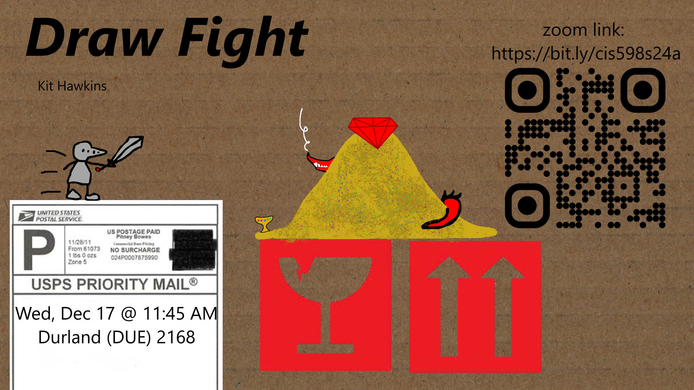
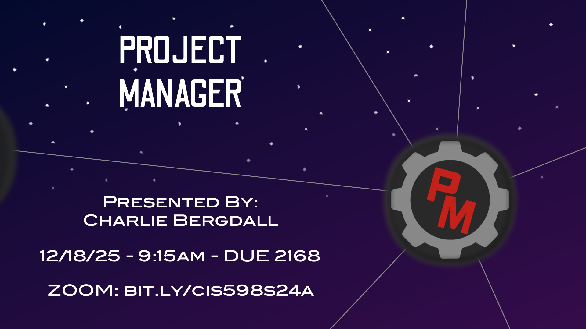
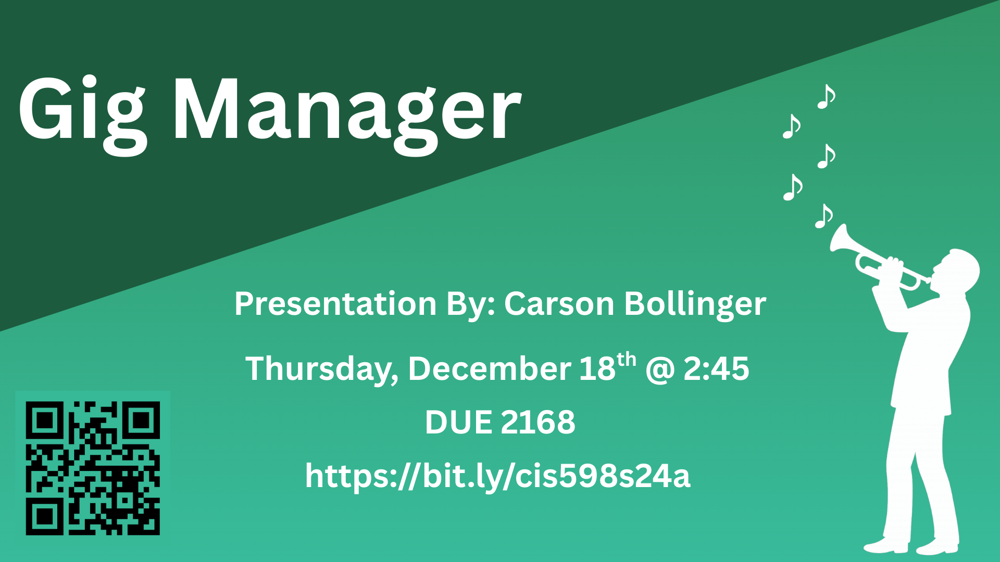
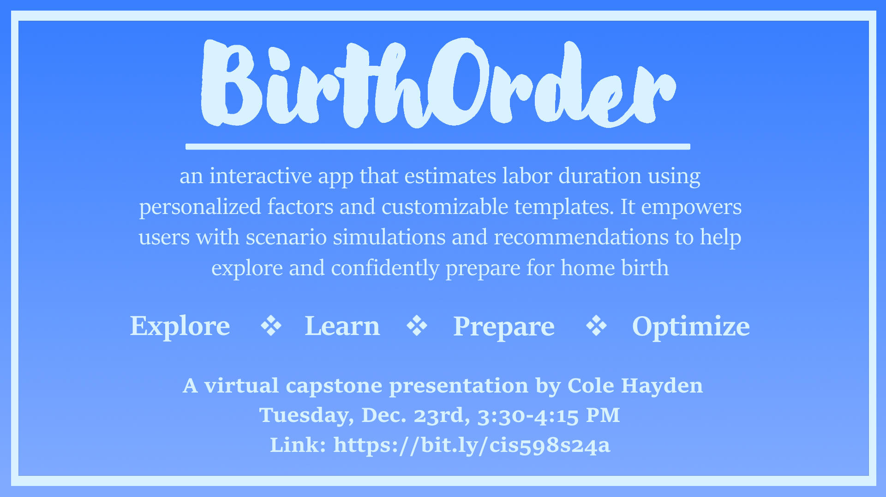
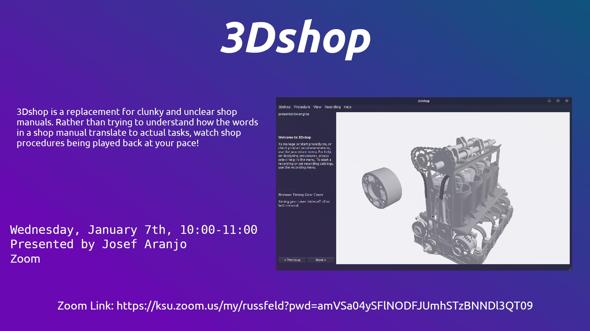

| Project | Student | Advisor | Date | Time | Location | Zoom |
|:-------:|:-------:|:-------:|:----:|:----:|:--------:|:----:|
| [ServiceSync]({}) | Nate Carter | Thornton | Fri, Dec 12 | 1:45 PM | DUE 2168 | [Zoom](https://bit.ly/cis598s24a) |
| [How Random is Pseudorandom?]({}) | Ryan Welch & Dillon McGinn | Amariucai | Tue, Dec 16 | 2:00 PM | DUE 2168 | [Zoom](https://bit.ly/cis598s24a) |
| [Verba]({}) | Wyatt Morris | Weese | Wed, Dec 17 | 8:00 AM | DUE 2168 | [Zoom](https://bit.ly/cis598s24a) |
| [CourseLogiCS]({}) | Jackson Cannell | Malallah | Wed, Dec 17 | 8:45 AM | DUE 2168 | [Zoom](https://bit.ly/cis598s24a) |
| [EduVista]({}) | Taj Ikhlaas | Malallah | Wed, Dec 17 | 9:30 AM | DUE 2168 | [Zoom](https://bit.ly/cis598s24a) |
| [Bizzi]({}) | Ayden Wyer | Bean | Wed, Dec 17 | 10:15 AM | DUE 2168 | [Zoom](https://bit.ly/cis598s24a) |
| [Pharma In Review]({}) | Daniel Robertson | McGinty | Wed, Dec 17 | 11:00 AM | DUE 2168 | [Zoom](https://bit.ly/cis598s24a) |
| [Draw Fight]({}) | Kit Hawkins | Andresen | Wed, Dec 17 | 11:45 AM | DUE 2168 | [Zoom](https://bit.ly/cis598s24a) |
| [BeefBase]({}) | Carson Toews | Weese | Wed, Dec 17 | 1:15 PM | DUE 2168 | [Zoom](https://bit.ly/cis598s24a) |
| [BoardClaimed]({}) | Matthew Gwaltney | Bean | Wed, Dec 17 | 2:00 PM | DUE 2168 | [Zoom](https://bit.ly/cis598s24a) |
| [TrailBlazer]({}) | Jack Schaeffer | James | Wed, Dec 17 | 2:45 PM | DUE 2168 | [Zoom](https://bit.ly/cis598s24a) |
| [Molecule Generation with Graph Neural Networks]({}) | Greyson Walker | McGinty | Wed, Dec 17 | 3:30 PM | DUE 2168 | [Zoom](https://bit.ly/cis598s24a) |
| [SmartDisc]({}) | Daniel Chang | Valenzuela | Wed, Dec 17 | 4:15 PM | DUE 2168 | [Zoom](https://bit.ly/cis598s24a) |
| [Project Manager]({}) | Charlie Bergdall | Feldhausen | Thur, Dec 18 | 9:15 AM | DUE 2168 | [Zoom](https://bit.ly/cis598s24a) |
| [Iron Rank]({}) | Cayden Hoffman | Bean | Thur, Dec 18 | 11:00 AM | DUE 2168 | [Zoom](https://bit.ly/cis598s24a) |
| [Hide and Seek Cars]({}) | Madeleine Smith | Andresen | Thur, Dec 18 | 11:45 AM | DUE 2168 | [Zoom](https://bit.ly/cis598s24a) |
| [Fragrance Genie]({}) | Chipo Sekabanja | Shamir | Thur, Dec 18 | 12:30 PM | DUE 2168 | [Zoom](https://bit.ly/cis598s24a) |
| [Kansas Population Trends Visualization]({}) | Amala John, Evan Harris, & Josh Zrubek | Bean | Thur, Dec 18 | 1:15 PM | DUE 2168 | [Zoom](https://bit.ly/cis598s24a) |
| [DashTA]({}) | Hiep Nguyen | Malallah | Thur, Dec 18 | 2:00 PM | DUE 2168 | [Zoom](https://bit.ly/cis598s24a) |
| [Gig Manager]({}) | Carson Bollinger | Thornton | Thur, Dec 18 | 2:45 PM | DUE 2168 | [Zoom](https://bit.ly/cis598s24a) |
| [Aerosuite]({}) | Ella Carlson | Feldhausen | Fri, Dec 19 | 10:30 AM | Virtual | [Zoom](https://bit.ly/cis598s24a) |
| [Agricultural Microworld]({}) | Max Casey, Daniel Cortez, Dakota Denton, & Jackson Saim | Bean | Fri, Dec 19 | 11:50 PM | DUE 2168 | [Zoom](https://bit.ly/cis598s24a) |
| [Threadfolio]({}) | Meghan Buchanan | Feldhausen | Fri, Dec 19 | 4:00 PM | Virtual | [Zoom](https://bit.ly/cis598s24a) |
| [BirthOrder]({}) | Cole Hayden | Andresen | Tue, Dec 23 | 3:30 PM | Virtual | [Zoom](https://bit.ly/cis598s24a) |
| [3D Shop]({}) | Josef Aranjo | Feldhausen | Wed, Jan 7 | 10:00 AM | Virtual | [Zoom](https://bit.ly/cis598s24a) |

## ServiceSync {#e0}

Nate Carter

ServiceSync is a web application designed to increase the workflow of how small maintenance companies manage their daily operations. Maintenance work often becomes scattered across paper notes, texts, and spreadsheets, making it difficult to track assignments, deadlines, and inventory. ServiceSync solves this by bringing work orders, technician scheduling, inventory tracking, invoice generation and preventive maintenance into one organized platform. With automated scheduling for preventive maintenance, real-time updates, and clear role-based access, the system helps companies stay efficient, reduce confusion, and keep their work running smoothly. 

## How Random is Pseudorandom? {#e20}

Ryan Welch & Dillon McGinn

Computers are (by design) completely deterministic - this is great for many situations, but detrimental to one important situation: randomness. Randomness is inherently not deterministic, so computers must improvise in order to generate/collect this random entropy. Are these pseudorandom creation and collection methods employed by moderns OS's (and ChatGPT for a bonus) adequate for use in cryptographic security that we depend on every day?

## Verba {#e1}

Wyatt Morris

Verba is a lightweight media to text system that cleans and equalizes audio, detects speech and produces structured clean transcripts with high accuracy on normal everyday hardware. Its focus is on practical processing while maintaining a high level of efficiency to be usable for students, creators and researchers who need fast, reliable transcription generation without the need for heavy duty hardware. Verba keeps the workflow simple with a drop in media concept that returns a polished and readable text that's ready for use in documents, project or canvas posts.

## CourseLogiCS {#e2}

Jackson Cannell

K-12 educators need access to more high-quality teaching materials to propel their students ahead of the curve in a world where AI raises the barrier to enter industry in Computer Science. CourseLogiCS is a modern React website for educators to download or borrow resources to assist their students. The platform keeps track of recent resources used and offers suggestions based on the individual and broad popularity of various resources. In addition, it provides a suite of statistics for administrators to track usage, see what is popular, and check satisfaction for any options given. Built on a modern tech stack of EntityFramework, React, and SQL Server, along with quick SSO from Auth0, using and maintaining this platform is easy and streamlined.

## EduVista {#e3}

Taj Ikhlaas

EduVista is a web-based analytics platform that helps instructors make sense of their Canvas LMS data. Built with Python and Streamlit, it solves the problem of having student data scattered across multiple Canvas exports by automatically matching and combining engagement data with gradebook information. The system uses regex pattern matching to categorize assignments (quizzes, labs, homework, etc.) regardless of inconsistent naming in Canvas, then provides interactive dashboards to visualize class performance trends. The core algorithmic component is a custom risk assessment system that analyzes grade trends over time, calculates weighted risk scores based on multiple factors (performance, engagement, assignment patterns), and detects specific at-risk behavioral patterns like consecutive grade declines or disengagement. This gives instructors explainable insights into which students need help and why, enabling data-driven intervention before students fall too far behind.

## Bizzi {#e4}

Ayden Wyer

Bizzi is a mobile CRM built for small home service businesses to track clients, jobs, and expenses, as well as save money on travel through optimized routing. This project makes the lives of small business owners and employees much easier, with a clean, easy to understand user interface and the tools that any home service business needs to compile all of their information in one place. The app is built using Expo, a React Native framework, along with a PostgreSQL Supabase backend, and support from the Mapbox API for geocoding and route optimization. Bizzi will be presented on December 17th at 10:15 AM in DUE 2168.

## Pharma In Review {#e5}

Daniel Robertson

To reduce the human labor cost of performing a systematic review of pharmacological literature, I use natural language processing to analyze the text of studies and provide useful information for practitioners and researchers. Human reviewers are perferred for their expertise in the field. So, I will use ontologies, or models that represent human knowledge for computing systems, to provide a foundation for ground truth to base my computer model. This project is dedicated to developing a framework for improving upon the existing natural language processing (NLP) models for biomedical research to make them more effective. Users will be able to use the summary statistics to learn to what extent the articles they are reviewing relate to their particular field of study and what gaps their literature may reveal in their ontologies. For instance, what drugs may be emerging in clinical trials but are not categorized in the ontology yet? These and other questions would no longer require significant human resources to research using this project.

## Draw Fight {#e6}

Kit Hawkins

Draw Fight is a fast-paced draw-your-own fighting game, where the choices you make when drawing your fighter determine the stats that your fighter has. This game draws from the mechanics behind Jackbox games, where players use their phones as input devices by connecting to a webpage instead of mouse and keyboard or controllers. Rounds in this game are usually less than 30 seconds, allowing rapid retooling of fighter designs in order to try to gain an edge against your opponents.

## BeefBase {#e7}

Carson Toews

BeefBase is a full-stack cattle management and analytics platform built to centralize and streamline ranch data operations. Developed using Django, SQLite, and modern web technologies, BeefBase provides an integrated environment for managing cattle inventory, health and vaccination records, feed schedules, sire/dam lineage, weight progression, carcass metrics, and producer analytics. The system includes interactive dashboards, automated data workflows, and flexible querying features to support informed decision-making in breeding, feeding, and herd performance optimization. This project demonstrates robust database design, RESTful backend development, and practical data engineering in an agricultural production context.

## BoardClaimed {#e8}

Matthew Gwaltney

My name is Matthew Gwaltney, and I am making a roguelike game inspired by boardgames using unity, the name being BoardClaimed. The goal of the game is to clear all the enemies off the board in this version of it, using events and reward spots to get stronger before fights. There are individual pools for each card, dice, and piece, along with events, combats, and enemies you can encounter. The player has a deck of cards, a set of dice to roll, and a single use piece to use when defeating board and card game themed enemies. Enemies make decisions based on the environment around them, taking in the condition of allies and the player to make choices. I used unity to make the game, visual studio to create the code, blender to make the models used, and inkscape to make the 2d artworks. Part of the project is the ability to easily add new items to each pool by putting in a new prefab into a specific folder, allowing for pools to be easily expanded in updates. My presentation of the game will take place on December 17th, at 2pm in Durland 2168, or online at https://bit.ly/cis598s24a. 

## TrailBlazer {#e9}

Jack Schaeffer

TrailBlazer is a web app designed to make road trips easier, smarter, and more enjoyable. It is designed to improve the experience by combining intuitive route creation with personalized travel recommendations. The platform simplifies every step of the planning, helping users discover attractions, organize stops, optimize travel times, and customize their journey based on their interests and constraints. It utilizes a react frontend to make a clean user interface, with ASP.NET C# backend to handle the route creations and data processing. The Google Maps API is used for mapping and location data. My presentation of TrailBlazer will take place in DUE 2168 on Wednesday, December 17th at 2:45 P.M. An online version of this presentation will be available at https://bit.ly/cis598s24a.

## Molecule Generation with Graph Neural Networks {#e10}

Greyson Walker

In this project, we investigate the affects of how molecular graphs and textual data can be used to create molecules for pharmaceutical purposes such as PTSD therapies. We developed deep learning models using Graph Neural Networks (GNN) to elucidate if textual categories and descriptions impart additional information to generate specific types of molecules. Built using Python and PyTorch, these models are capable of outputting molecules relating to a wide variety of pharmacological domains.

## SmartDisc {#e11}

Daniel Chang

SmartDisc is a disc golf recommendation system that helps players select optimal discs for any throw. The application analyzes hole characteristic, current weather conditions, and player profile data to provide personalized disc recommendations. Built with React, Flask, Python, JavaScript, and SQLite database, the system utilizes a multi-factor scoring algorithm that weighs physics-based flight path calculations, strategic course considerations, and player-specific compatibility. Real-time weather integration via OpenWeather API ensures recommendations account for current conditions. This project demonstrates practical applications of data-driven decision making, RESTful API design, and full-stack web development.

## Project Manager {#e13}

Charlie Bergdall

Project Manager is a desktop application for Windows and MacOS built in Flutter, designed to help those who are always working on different projects keep track of them in one centralized location. Keeping track of endless projects with unique requirements in large cluttered spreadsheets creates many headaches. Project Manager makes this process better by tracking only the simplest data about projects, then uses a tagging system to allow projects to hold more complex project-specific data. Data pertaining to projects is stored in a Postgres database which is exposed on the internet with a FastAPI application. The database is made secure by implementing JSON Web Tokens for authentication. Project Manager also keeps track of the hours spent on a project by anyone who may be contributing to it, and uses a complex weighted ranking algorithm to suggest the ideal project to work on next. Charlie Bergdall will be presenting about Project Manager on Thursday, 12/18/25 at 9:15am in DUE 2168 (also available via zoom: https://bit.ly/cis598s24a)

## Iron Rank {#e14}

Cayden Hoffman

Iron Rank is full-stack strength-tracking and social leaderboard application that normalizes user lifting data and compares performance across demographic factors. The system is built with a C# ASP.NET core API Backend connected to SQL Server database, using endpoints for authentication, group management, and lift normalization. The backend uses PBKDF2 hashing, custom normalization logic, and structured DTOs for secure data exchange. The React-based frontend includes an interactive muscular-skeleton interface that allows users to click muscle groups to input lift data directly, enhancing usability and engagement, alongside dynamic leaderboard views with expandable lift histories and group management tools that communicate with the backend via asynchronous API calls. Together, these components deliver a robust platform that blends analytics, visualization, and community-driven fitness tracking.

## Hide and Seek Cars {#e15}

Madeleine Smith

Hide and seek cars is a scalable interactive demonstration for the computer science department to let people see what we can do here. Using an M5StickC Plus and some robotic cars. Using primarily python/micropython, raspberry pi, and UIflow2 a handful of cars were taught to play hide and seek in a modular environment. They have the ability to map out the board. They are also made in a way so that adding or combining new and existing rules would be easy so that the cars could learn new games in the future. 

## Fragrance Alert Application {#e16}

Chipo Sekabanja

My project is called Fragrance Genie, and what it is a full-stack web application that enables users to track and manage and interact with the fragrance product data. . So oftentimes, retailers could have the lowest price for a particular fragrance in one scenario, but not in another. So one has to check out many options before finding the cheapest one. What this project does is it enables students to find the lowest across the board. In addition, because users are not always fully aware of what a product is like before buying it, the application incorporates sentiment analysis to give them a more comprehensive understanding of the fragrance they’re considering. We're using React front-end and Node.js/ Express back-end, MongoDB, sentiment analysis and website scraping.

## Kansas Population Trends Visualization {#e17}

Amala John, Evan Harris, & Josh Zrubek

The purpose of our project is to demonstrate the population trends of counties in Kansas throughout history through data visualization. Our program allows the user to select which sets of data the map will display, the decade that the map will display (with data relative to that decade), and will allow the user to zoom in and out of a specific county so they can see more sets of data. The data that our project uses ranges from Census data to data that we obtained manually through our own research. Our program can be used in schools across Kansas to help students understand the changes in population over time in different counties across Kansas.

## DashTA {#e18}

Hiep Nguyen

Currently a multitude of tools are used to facilitate Teacher Assistant's work. DashTA is a CRUD based dashboard system which allows for TAs and Instructors to perform tasks which may have previously taken multiple tools and "sectors" to perform. Built using Django alongside external tools such as Redis and Docker, DashTA heavily focuses on only presenting the most important information about a TA's workflow and for CRUD features to be made possible with as few clicks as possible. TAs are able to perform their duties such as claiming tasks or facilitating office hours without switching tabs. Instructors may push new assignments and announcements which are made available instantaneously for all users. 

## Gig Manager {#e19}

Carson Bollinger

Gig Manager is a musician-focused web application that helps users discover, schedule, and manage upcoming gigs. Built with Blazor, C#, SQLServer, and ASP.NET Core Identity, it lets users create accounts, book and manage upcoming gigs, and explore user profiles/upcoming gigs. Musicians can also define preferences and be recommended gigs to try to book. This will be presented by Carson Bollinger in DUE 2168 on December 18 at 2:45PM and can be viewed virtually via zoom here: https://bit.ly/cis598s24a

## Aerosuite {#e24}

Ella Carlson

Aviation is renowned for being slow and tedious when developing new products for consumers. Due to Aviation certification is high stakes, long cycle, and documentation heavy. End to end traceability is often tracked across multiple platforms (email, one drive, spreadsheets, etc) which makes evidence towards progress difficult to quantify. Aerosuite is an aviation certification and compliance web application, centralizing certification evidence and simplifying progress tracking for aviation programs managing multiple OEM partners. This program takes verification artifacts (requirements, tests, reviews, OEM requests) and provides live dashboards of compliance status. In addition, assistance is provided through document auto tagging, gap flagging, and schedule risk prediction to shorten verification cycles and reduce audit findings.

## Agricultural Microworld {#e22}

Max Casey, Daniel Cortez, Dakota Denton, & Jackson Saim

Agricultural Microworld is an application designed to teach both basic programming, and details of how modern agriculture works. Using Blockly to provide components for running a program, we will introduce concepts that can apply to a large range of students of all grades K-12. With our application, we hope to educate students on all the details of today’s agricultural systems, including autonomous driving, navigation pathing, factors affecting soil, and more. This presentation will focus on the structure we have created and fine-tuned, and how we plan to take it going forwards. You can join us at 11:50 AM on December 19th, in room DUE 2168, or via Zoom at the link: https://bit.ly/cis598s24a.

## Threadfolio {#e25}

Meghan Buchanan

Attention cross-stitchers! Do you have all of your floss in a plastic bag like I do? Store your current projects in a grocery store bag? Then Threadfolio might be for you! Threadfolio is for the unorganized cross-stitchers, or the organized ones that want to go digital. In this app, you can keep track of your projects and materials. Starting a new project? Upload the pattern’s PDF and Threadfolio will tell you what you need to buy to do the project. Never again will you have to go to the craft store multiple times for a single project.

## Birth Order {#e26}

Cole Hayden

BirthOrder is a native desktop application, with potential extension to mobile platforms, developed using .NET MAUI with C# and XAML to provide an interactive tool for couples and individuals exploring home birth as an alternative to traditional hospital labor. The application collects user-defined factors—such as maternal stress levels—and generates an estimated labor duration in hours. To enhance flexibility, BirthOrder supports customization through user-added factors and templates, enabling tailored simulations of the labor estimation process. Beyond prediction, the system delivers actionable recommendations to help optimize conditions for home birth, offering a sandbox-style environment where users can experiment with different scenarios and gain insights into how various choices may influence outcomes. BirthOrder aims to empower users with a dynamic, interactive, and customizable experience to aid in preparation for home birth.

## 3D Shop {#e27}

Josef Aranjo

3Dshop is a replacement for clunky and unclear shop manuals. Rather than trying to understand how the words in a shop manual translate to actual tasks, watch shop procedures being played back at your pace! Users can create their own procedures for existing engine models and record video annotations for procedures. You can also search for product recommendations based on active procedures. 3Dshop is built using C++ and Qt/Qt3D.
