| Project | Student | Advisor | Date | Time | Location | Zoom |
|:-------:|:-------:|:-------:|:----:|:----:|:--------:|:----:|
| [LLMGuard: An Integrity Attestation Framework for Large Language Models]({}) | Aayush Rai | Vasserman | Wed, May 6 | 11:30 AM | {}2183{} | {}Zoom B{} |
| [Ascend: An RPG-Based Fitness Tracking Application]({}) | Johnny Hug | Weese | Tue, May 12 | 8:45 AM | {}2168{} | {}Zoom A{} |
| [Revix for Educators]({}) | Kevin Roy | Shamir | Tue, May 12 | 9:00 AM | {}2183{} | {}Zoom B{} |
| [Good Reviews]({}) | Andrew Osterhaus | Feldhausen | Tue, May 12 | 9:30 AM | {}2168{} | {}Zoom A{} |
| [Minecraft Variational Autoencoder]({}) | Henry Hornung | Shamir | Tue, May 12 | 9:45 AM | {}2183{} | {}Zoom B{} |
| [Urban Flow]({}) | Christian Ramirez-Chavez | Valenzuela | Tue, May 12 | 10:15 AM | {}2168{} | {}Zoom A{} |
| [ComparePro]({}) | Clayton Burgess | Thornton | Tue, May 12 | 10:30 AM | {}2183{} | {}Zoom B{} |
| [Ascend]({}) | Kaitlyn Pritchard | Feldhausen | Tue, May 12 | 12:00 PM | {}2168{} | {}Zoom A{} |
| [Shooting Guys 3]({}) | Hunter Evans | Bean | Tue, May 12 | 12:45 PM | {}2168{} | {}Zoom A{} |
| [Split Chase]({}) | Joey Monaco | Bean | Tue, May 12 | 1:30 PM | {}2168{} | {}Zoom A{} |
| [Crucidex]({}) | Jess Barrett | Bean | Tue, May 12 | 2:15 PM | {}2168{} | {}Zoom A{} |
| [Protocol: Automata]({}) | Carson Kinsch | Bean | Tue, May 12 | 3:00 PM | {}2168{} | {}Zoom A{} |
| [Farpoint Training]({}) | Josh Caldwell | Keller | Tue, May 12 | 3:45 PM | {}2168{} | {}Zoom A{} |
| [Zactify Insights]({}) | Zac Atchison | Thornton | Tue, May 12 | 4:30 PM | {}2168{} | {}Zoom A{} |
| [Jetski Maintenance Tracker]({}) | Colin Harrison | Andresen | Wed, May 13 | 8:45 AM | {}2183{} | {}Zoom B{} |
| [RideCircle]({}) | Jake May | Weese | Wed, May 13 | 9:30 AM | {}2183{} | {}Zoom B{} |
| [Recip-EZ]({}) | Caden Swanson | Weese | Wed, May 13 | 10:15 AM | {}2183{} | {}Zoom B{} |
| [Title]({}) | Evan Harris Amala John Joshua Zrubek | Bean | Wed, May 13 | 11:00 AM | {}2183{} | {}Zoom B{} |
| [LibraryLive]({}) | Mark Preston | Valenzuela | Wed, May 13 | 11:45 AM | {}2183{} | {}Zoom B{} |
| [Title]({}) | Max Casey Daniel Cortez Dakota Denton Jackson Seim | Bean | Wed, May 13 | 1:00 PM | {}2183{} | {}Zoom B{} |
| [LiftLog]({}) | Cooper Tammen | Thornton | Wed, May 13 | 1:45 PM | {}2183{} | {}Zoom B{} |
| [VimDoc]({}) | Julie Dinhphan | Neilsen | Wed, May 13 | 2:00 PM | {}2168{} | {}Zoom A{} |
| [Cats N Dogs]({}) | Jack Jara | Feldhausen | Wed, May 13 | 2:30 PM | {}2183{} | {}Zoom B{} |
| [Formal Analysis of the Signal Protocol]({}) | Trenton Chrisco Beny Christian Garrett Greathouse Easton Hain Gavin Kellam Vania Santillana | Vasserman | Wed, May 13 | 3:15 PM | {}2183{} | {}Zoom B{} |
| [Verbum]({}) | Owen Pearsall | Amtoft | Wed, May 13 | 3:30 PM | {}2168{} | {}Zoom A{} |
| [Volant Reader]({}) | Robby Clausel | Andresen | Wed, May 13 | 4:00 PM | {}2183{} | {}Zoom B{} |
| [Shopnow]({}) | Dean Blickenstaff | Feldhausen | Wed, May 13 | 4:15 PM | {}2168{} | {}Zoom A{} |
| [Cart Pilot]({}) | Takumi Hendricks | Keller | Thur, May 14 | 8:15 AM | {}2183{} | {}Zoom B{} |
| [Interdisciplinary Techniques for Entropy Evaluation]({}) | Patrick Kehoe Timothy Larson Creighton Moes Nicholas Slinker Connor Wiedenmann | Amariucai | Thur, May 14 | 8:30 AM | {}2168{} | {}Zoom A{} |
| [When Water Isn't Safe]({}) | Kylie Phommasack | Malallah | Thur, May 14 | 9:00 AM | {}2183{} | {}Zoom B{} |
| [PathFlow]({}) | Braden Adams | Feldhausen | Thur, May 14 | 9:15 AM | {}2168{} | {}Zoom A{} |
| [Title]({}) | Corbin Hoppas | Weese | Thur, May 14 | 9:45 AM | {}2183{} | {}Zoom B{} |
| [Type Learner]({}) | Cole James | Feldhausen | Thur, May 14 | 10:00 AM | {}2168{} | {}Zoom A{} |
| [SecureDial]({}) | Griffin Miller | Shamir | Thur, May 14 | 10:30 AM | {}2183{} | {}Zoom B{} |
| [Simulating Ethics]({}) | Riley Reynolds | Lang | Thur, May 14 | 10:45 AM | {}2168{} | {}Zoom A{} |
| [Shooting Guys TD]({}) | Tate Alfred | Bean | Thur, May 14 | 11:30 AM | {}2168{} | {}Zoom A{} |
| [CIS 598 Dashboard]({}) | Kasen Fudge | Feldhausen | Thur, May 14 | 12:15 PM | {}2168{} | {}Zoom A{} |
| [Dataying Block Programming]({}) | Nalen Rangarajan | Malallah | Thur, May 14 | 2:00 PM | {}2168{} | {}Zoom A{} |
| [Title]({}) | Hasan Hanafieh | Weese | Thur, May 14 | 2:45 PM | {}2168{} | {}Zoom A{} |
| [Analyzing the Security Model of MCP for Satellite Communications]({}) | Sebastian Alturck-Carlos Calvin Beechner Jesus Castro-Garcia Noe Rosales Jose Varela | Chen | Thur, May 14 | 3:30 PM | {}2168{} | {}Zoom A{} |
| [H.O.U.S.E.K.E.E.P.E.R]({}) | Logan Hayward | Neilsen | Thur, May 14 | 4:15 PM | {}2168{} | {}Zoom A{} |

## LLMGuard: An Integrity Attestation Framework for Large Language Models {#e0}

Aayush Rai

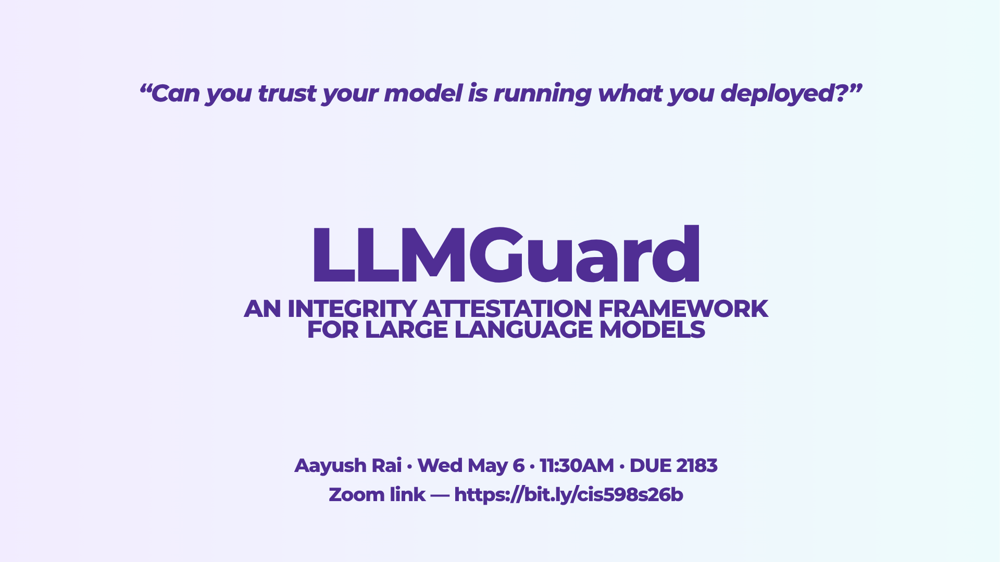

Large language models are showing up in more and more production systems, which makes them an attractive target for tampering. An attacker can mess with the model at several points in the pipeline - at rest before it's loaded, during loading, or while it's actually serving requests and most existing defenses only cover one of those points. LLMGuard is a framework that tries to cover more of the pipeline by combining two ideas from the literature. The first is load-time measurement using a TPM and the Linux Integrity Measurement Architecture (IMA), which checks whether the model's files and configuration have been tampered with before they get loaded. The second is runtime behavioral attestation, which uses a trusted execution environment to keep a set of secret test inputs and expected activations and uses them to check whether the running model is still behaving the way it's supposed to. Together these two layers handle an adversary model where the LLM process itself is treated as the attacker and is assumed to be able to modify its own memory, files, and runtime.

## Ascend: An RPG-Based Fitness Tracking Application {#e3}

Johnny Hug

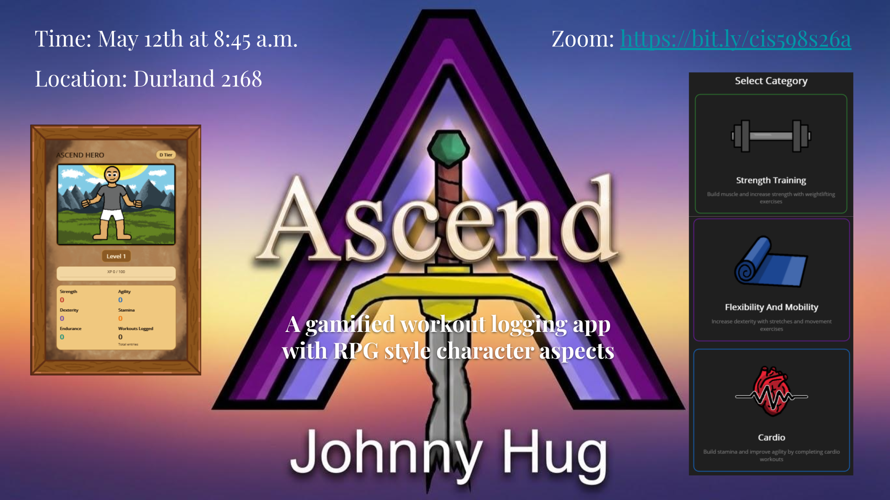

Ascend is a mobile application developed using .NET MAUI that combines traditional workout tracking with role-playing game (RPG) mechanics. Users can log workouts across multiple categories such as strength training, cardio, and flexibility, while simultaneously developing a customizable in-app character whose stats reflect their real-world activity. The application features dynamic workout input forms, a workout history system, and a character progression interface presented as a stylized RPG card. The system architecture includes a centralized manager class for handling data and logic, along with many UI pages designed for user interaction and navigation. Future development includes expanded character customization, more available achievements, and quest-based progression. This project demonstrates the integration of fitness tracking with gamification principles to improve user engagement and motivation. 

## Revix for Educators {#e4}

Kevin Roy

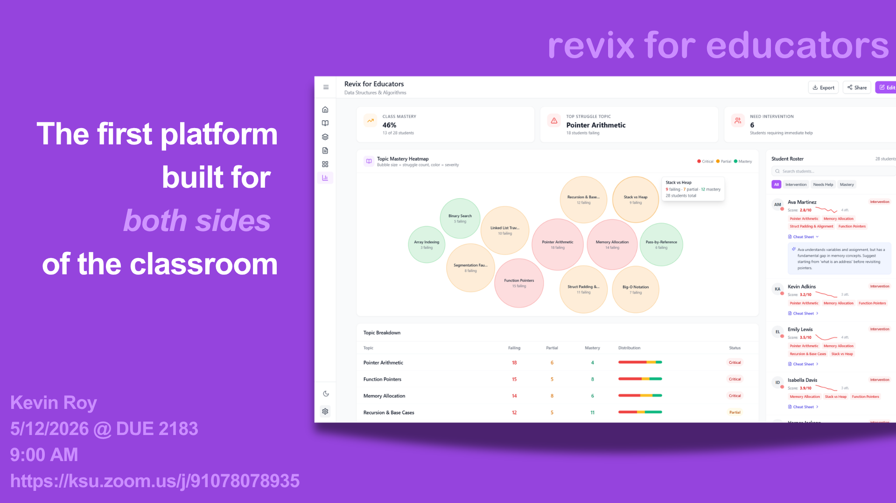

The average U.S. teacher works 50+ hours a week, most of it after hours, most of it unpaid.

That's why we built Revix for Educators.

Upload your lesson materials once. Within minutes:
✅ Your slides are ready
✅ Your assignments are generated
✅ Your students each get a custom study set on revix ai tied directly to what you taught

Students show their understanding through a short Socratic dialogue with Xara, our AI. With the student progress analytics teachers can see exactly who’s stuck, and on what, before the exam.

What this means
🧑‍🏫 For teachers: Less busywork. Real insight. And a few hours back in your week.
🧑‍🎓 For students: Low-pressure check-ins and personalized support the moment they struggle.

## Good Reviews {#e5}

Andrew Osterhaus

I am Andrew Osterhaus and my senior design is called Good Reviews. It is a web application that is built with a VUE frontend, JavaScript backend, Supabase for its database, and utilizes the structure and principles of a Restful API. The goal of the application is to provide modern readers with a better experience in discovering new books to read. By vectorizing the descriptions of books and creating a personalized vector for each user, recommendations are given based on the similarity of book vectors and user vectors, which are presented with a focus on user reviews and AI generated summaries that seek to give more information than simple book covers can. I will be presenting on Tuesday the 12th at 9:30 in DUE 2168 in person or over zoom at https://bit.ly/cis598s26a

## Minecraft Variational Autoencoder {#e6}

Henry Hornung

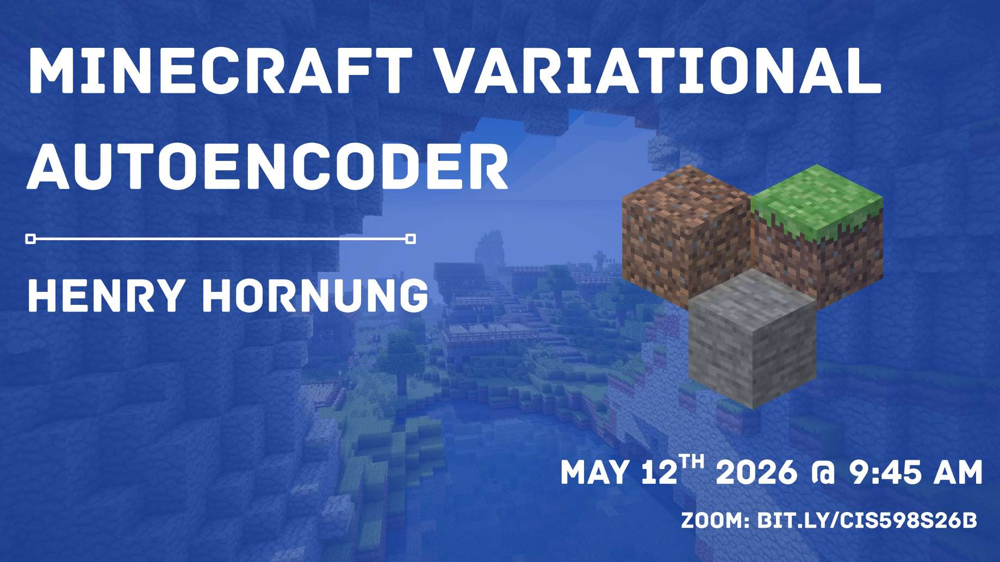

My Research Project explores the applicability of machine learning to Minecraft. By using 3D snippets of player-made builds as a dataset, I trained a ‘Variational Autoencoder’ (VAE) to compress and reconstruct these builds. In my experiment, I tested how different data-preprocessing techniques affect the reconstruction quality of this VAE once training is complete. My presentation will delve into specifics of my dataset, data analysis, and experiment logistics & quantitative results. I will give my presentation on May 12th at 9:45am in DUE 2183, with a zoom link as well: https://bit.ly/cis598s26b.

## Urban Flow {#e7}

Christian Ramirez-Chavez

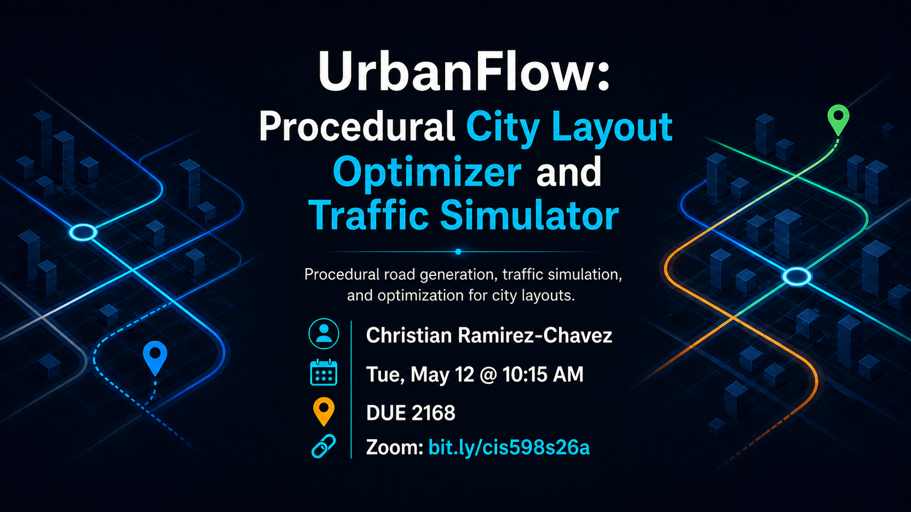

Christian Ramirez-Chavez will present UrbanFlow: Procedural City Layout Optimizer and Traffic Simulator on Tuesday, May 12 at 10:15 AM in DUE 2168, with Zoom access at bit.ly/cis598s26a. UrbanFlow is an interactive city-planning sandbox that allows a user to place destinations such as homes, workplaces, schools, and grocery stores along with terrain obstacles like water and mountains, then automatically generate and improve a road network that balances travel efficiency and construction cost. The project uses graph modeling, shortest-path routing, traffic scoring, and heuristic optimization to evaluate how well a city layout supports movement and congestion. It is being built as a web application using Next.js, React, and TypeScript, along with custom pathfinding, scoring, and optimization logic to support live visualization and experimentation with different city-planning priorities. 

## ComparePro {#e8}

Clayton Burgess

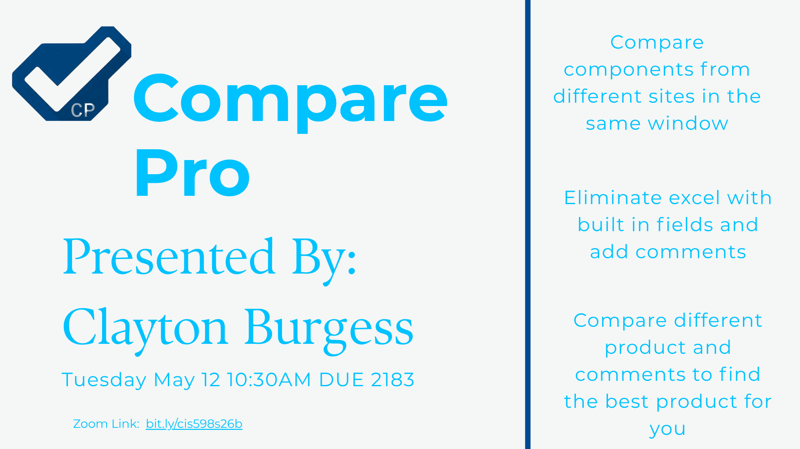

ComparePro is a web application that lets users compare products (computer parts) from different websites to eliminate having multiple windows open at once. It also allows the user to do their research as well allowing them to add comments and compare products from which they have commented on. Put together to have a social media like feel that allows users to like products for future research.

## Ascend {#e9}

Kaitlyn Pritchard

Ascend is a fitness tracking app that focuses on personalized progress and recovery. Users can track strength and cardio workouts, along with customizable inputs such as energy levels and personalized check-ins before or after each workout. The app includes goal tracking with automatic completion detection and a recovery heat map that highlights which muscle groups are ready to train. It also encourages progression by suggesting increases in weight when exercises become easier. Social features allow users to connect with friends, stay motivated, and track streaks, statistics, and rankings. Built using Flutter and Dart, the app creates a smarter, more motivating fitness experience that helps users stay consistent and build sustainable habits.

## Shooting Guys 3 {#e10}

Hunter Evans

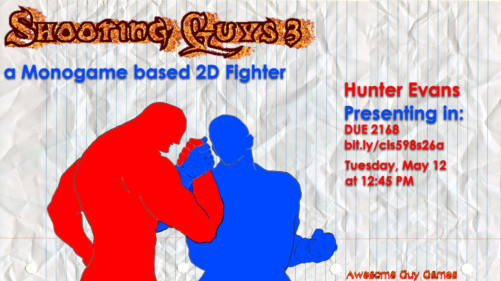

Shooting Guys 3 is a 2D fighting game developed in C# using the Monogame/XNA Framework. The project's goal is to be an approachable platform for beginner fighting game players to learn fundamentals, but with enough depth to be enjoyed by experienced players. Its architecture was built to be modular and scalable for ease of future development. Shooting Guys 3's gameplay is state-based with an animation player to sync visuals to each character's current state. Enjoy tight controls and an implemented magic system to make intuitive, flowing combos. Join the fight on Tuesday, May 12th in DUE 2168 at 12:45 pm. 

## Split Chase {#e11}

Joey Monaco

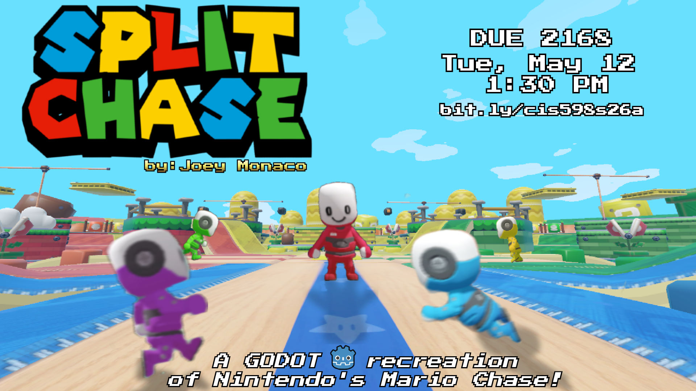

SPLIT CHASE is 3D a 2-5 player-versus-player asymmetric multiplayer video game that recreates a more accessible online remake of the mini-game “Mario Chase” from the WII U game, “Nintendo Land”! This project utilizes the Godot Game Engine's modular node-based architecture in combination with low-level UDP network packet handling to bring Nintendo's local- locked fun back online! The game features implementations of real-time online player location synchronization, physics-based gameplay, mixed manipulation of user viewports, 3D animation, and so much more. 

## Crucidex {#e12}

Jess Barrett

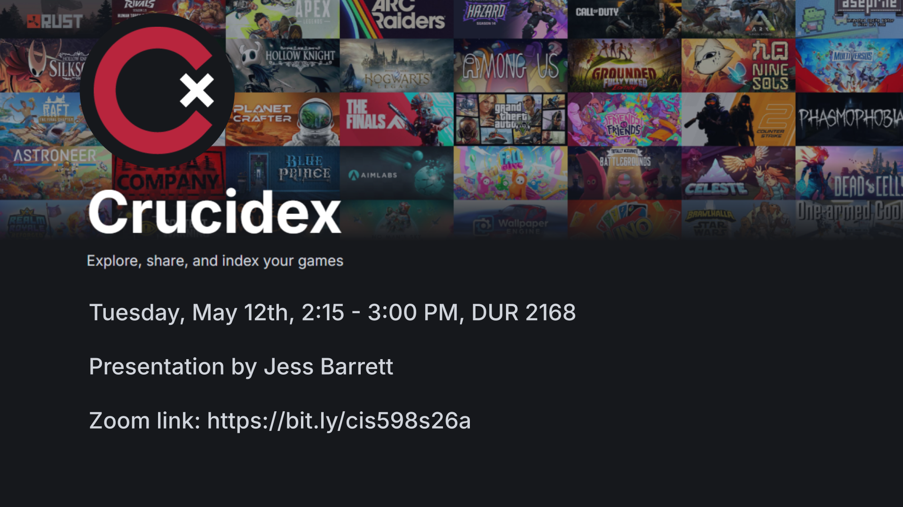

Crucidex is a web-based platform for tracking, organizing, and showcasing a user's video game history and inspired by Letterboxd for films. Built with Next.js, TypeScript, and Supabase (PostgreSQL), the application lets users build a personal game library by manually searching the IGDB API (Internet Game Database) or automatically importing from Steam via the Steam Web API. Users can rate games on a ½ - 5 star scale, track playtime, and curate a "Top 4" favorites display on their profile. The core algorithmic component is a collaborative filtering recommendation system that identifies users with similar gaming preferences using Jaccard similarity and rating alignment metrics, then suggests games those similar users have enjoyed. The system addresses scalability through an inverted index approach by comparing only users who share games, pre-computed recommendation caching with a 24-hour TTL, and background job processing. The tech stack also includes Tailwind CSS for styling and Row-Level Security for data protection. The application is deployed and hosted on Vercel at crucidex.com. 

## Protocol: Automata {#e13}

Carson Kinsch

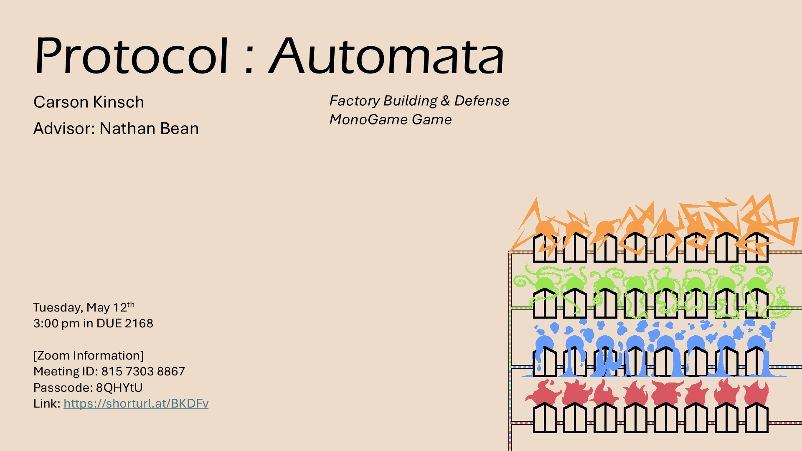

Protocol Automata is a work-in-progress 2D top-down fantasy factory building & defense game built using the C# framework Monogame. In this game you must build up your factory, automating production lines and allocating resources effectively, while defending a central main base. Resources are generated using Poisson Disk Sampling depending on the base location the player chooses on the playable map area. Using a grid-based tile system, structures, resources, and other tile based objects in the game are placed and rotated according to the tiles in proximity to each other. 

## Farpoint Training{#e14}

Josh Caldwell

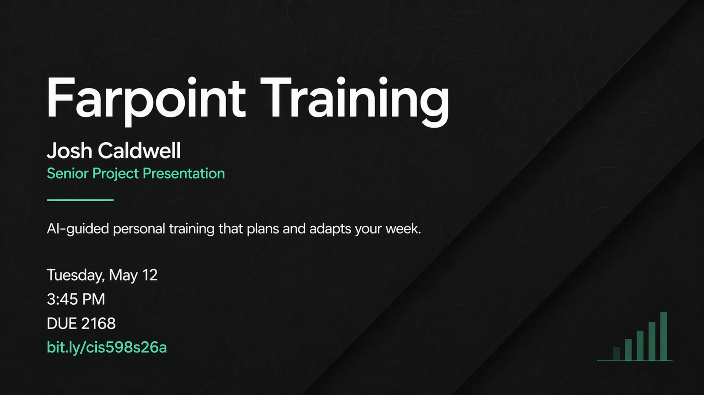

Farpoint Training is an AI personal training platform for self-coached athletes that helps users build context-rich training profiles, generate adaptive weekly plans, log completed workouts, and use long-term training history to inform future recommendations. The project combines AI-assisted onboarding and planning with structured domain models for activities, goals, training blocks, metrics, workout templates, and training logs. It is being developed as a modern web application with a Django backend, Vue frontend, PostgreSQL database, and asynchronous background generation workflows for plan creation. The development process also made use of agentic development tools, including Claude Code and Codex, to support implementation, iteration, and refinement throughout the project. Josh Caldwell will present Farpoint Training on Tuesday, May 12 at 3:45 PM in DUE 2168, and the Zoom link for the presentation is bit.ly/cis598s26a. 

## Zactify Insights {#e15}

Zac Atchison

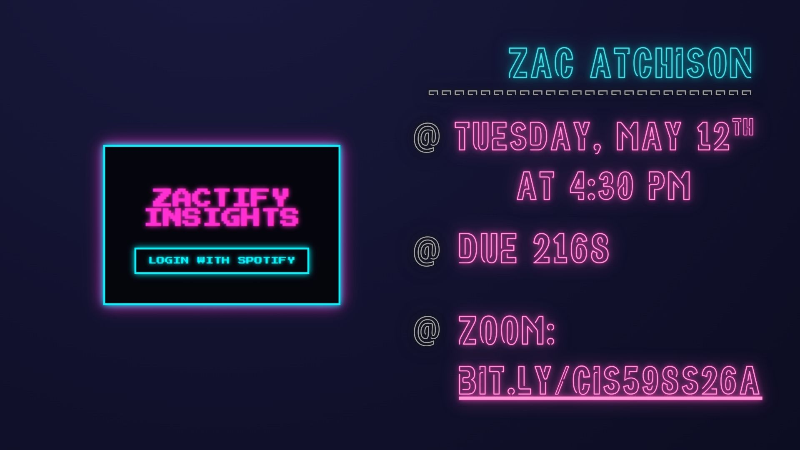

Zactify Insights is a full-stack web application designed to analyze and visualize a user’s Spotify listening data in order to provide meaningful insights and support personalized playlist generation. The system collects user data such as top tracks, artists, and genres, and processes it into an interactive dashboard that allows users to explore their listening habits across different time frames. The playlist generation feature compares a user’s listening profile against a larger dataset of songs to generate tailored playlists based on their preferences. This project is built using a React frontend with a C#/.NET Web API backend and a SQL Server database, and integrates with the Spotify API for authentication and data retrieval. This project will be presented on Tuesday, May 12th at 4:30 PM, by Zac Atchison in DUE 2168. It will also be available on Zoom: bit.ly/cis598s26a

## Jetski Maintenance Tracker {#e17}

Colin Harrison

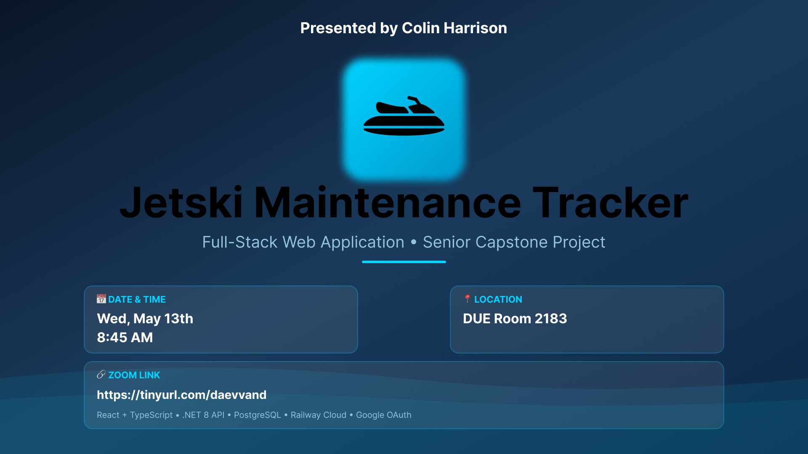

The Jetski Maintenance Tracker is a full-stack web application designed to help jetski owners and service shops manage maintenance schedules, track engine hours, and receive automated service reminders. Built with a modern tech stack including React 18 with TypeScript and Framer Motion for the frontend, .NET 8 Web API with Entity Framework Core for the backend, and PostgreSQL for data persistence, the application features Google OAuth authentication, role-based access control (Hobbyist, Service Shop, and Admin roles), and automated email notifications using MailKit. The system provides intelligent maintenance recommendations based on Sea-Doo's official service intervals, tracks multiple jetskis per user with detailed maintenance history, and includes owner contact management for service shops. Deployed on Railway with separate frontend and backend services, the application demonstrates cloud deployment practices, RESTful API design, and responsive UI/UX principles. Key features include PDF export of maintenance records, real-time service recommendations, and a comprehensive dashboard for tracking watercraft health across an entire fleet.

## RideCircle {#e18}

Jake May

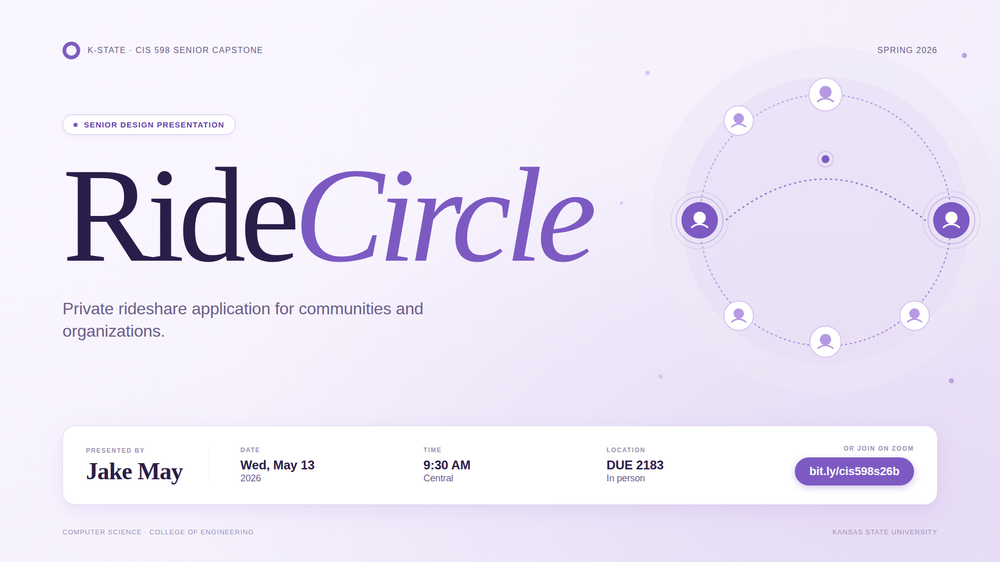

RideCircle is web application that reimagines rideshare services like Uber and Lyft aimed at smaller communities and organizations rather than the general public. Users can create or join private groups (student organizations, workplaces, weddings, churches), and rides can only be requested from and fulfilled by members of that same group. The application is built with a Vue.js frontend, ASP.NET backend and SQL Server database, with SignalR WebSockets to manage real time communication between passengers and drivers. Nominatim and OSRM provide geocoding and routing services, enabling real-world trip durations and ETAs rather than straight line approximations. The core technical contribution is a custom dispatch algorithm that optimizes for passenger wait-times, driver deadheading (travel without passengers), and queue fairness across each group’s pool of active drivers. The goal is to give users a network of trusted members, a one-stop shop for requesting and fulfilling rides, and a dispatch algorithm that outperforms generic FIFO or Round Robin queues.

## Recip-EZ{#e19}

Caden Swanson

It’s difficult to keep track of your kitchen’s inventory when dealing with the hustle and bustle of adult life. What’s even harder is figuring out what to do with leftover ingredients taking up space in your kitchen. On Wednesday, May 13th, at 10:15 AM at DUE 2183, Caden Swanson will talk about what he created to help quell this chaos. Recip-EZ is the one-stop web application that gives you the tools to keep track of your kitchen’s inventory in one place. Using a React front-end, C# DOTNET back-end, and SQL database, this application tracks user inventory items and curates potential recipes based on those tracked ingredients. From these inventory items, Recip-EZ will be able to determine whether a recipe is “ready to cook”, “almost ready”, or “not really possible” with your current items 

## Project Name {#e20}

Evan Harris, Amala John, Joshua Zrubek

Abstract

## LibraryLive {#e21}

Mark Preston

One of the most common problems faced by avid readers is finding what to read next. LibraryLive is a Java-powered web app designed to connect you with books you will actually love. With an expansive database powered by MySQL you are almost guaranteed to find something to read. Write reviews for the books you love and rate the books you have read to develop a taste profile that will inform future recommendations. LibraryLive learns your preferences through your previously read books, ratings, and reviews to tailor its recommendations to suit your taste, as well as recommending books from other users with similar tastes to help you discover those hidden gems you might otherwise miss. LibraryLive also affords users the flexibility to change parameters for recommending books allowing users to find results that align more closely with favorite books or authors. With LibraryLive you’ll spend less time searching for books and more time reading. Presentation and demonstration of the project will be by Mark Preston on Wednesday May 13th at 11:45am in DUE 2183 come in person or via zoom (bit.ly/cis598s26b). 

## Project Name {#e22}

Max Casey, Daniel Cortez, Dakota Denton, Jackson Seim

Abstract

## LiftLog {#e23}

Cooper Tammen

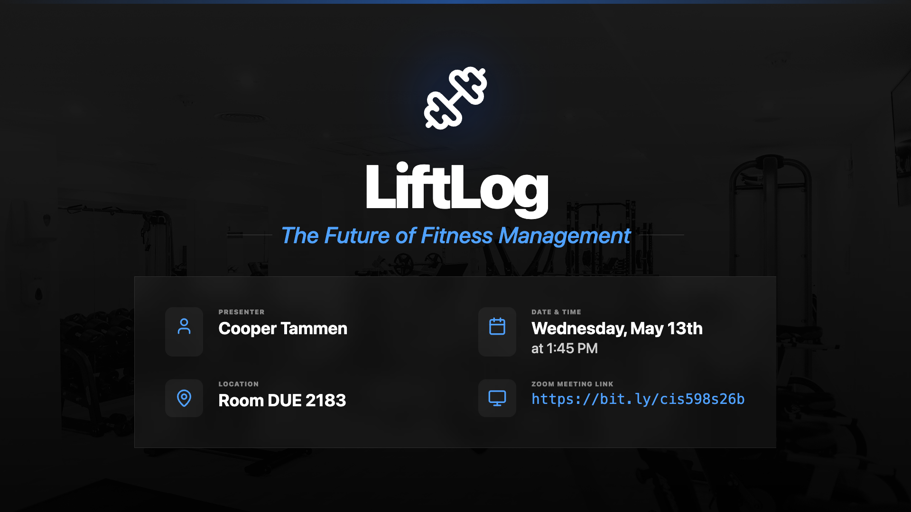

LiftLog is a web-based workout tracker built with Blazor Server (.NET 10) that lets users create custom templates from 873 exercises and log workouts with progressive overload recommendations. The app uses SQLite with Entity Framework Core for storage and ASP.NET Core Identity for authentication, and runs a Brzycki 1RM algorithm that analyzes workout history to suggest weight and rep targets based on difficulty ratings and plateau detection.

## VimDoc {#e24}

Julie Dinhphan

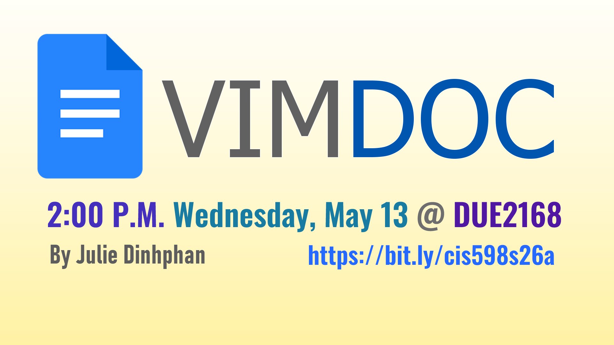

VimDoc is a chrome-based browser extension designed to incorporate vim- style commands into a google docs environment through the use of event listener overrides and user keyboard intercepts. It aims to reduce context-switching for a more efficient workflow. This project will be presented by Julie Dinhphan in DUE 2168 @ 2:00 P.M. or via Zoom @ https://bit.ly/cis598s26a.

## Cats N Dogs {#e25}

Jack Jara

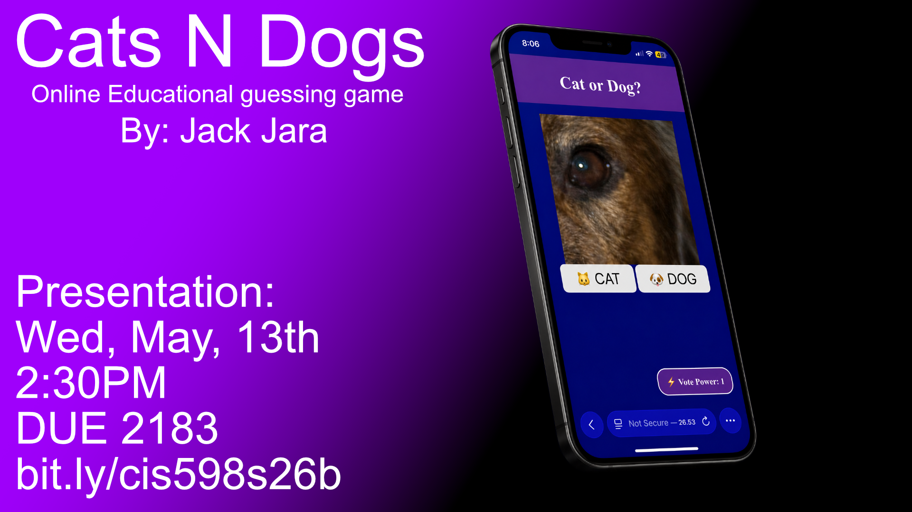

Cats n Dogs is an interactive web-based classroom game, similar to Kahoot or Jackbox, designed to simulate the core concept behind artificial neural networks. The game assigns each student a unique section of a larger image and asks them to vote on whether the full image contains a cat or a dog. Correct votes increase a student's voting power in later rounds, mirroring how neural network connection weights strengthen through training. Built with Node.js, Express, and Socket.IO for real-time multiplayer communication, Cats n Dogs is designed to bridge the gap between classroom theory and real-world machine learning concepts. 

## Formal Analysis of the Signal Protocol {#e27}

Trenton Chrisco, Beny Christian, >Garrett Greathouse, Easton Hain, Gavin Kellam, Vania Santillana

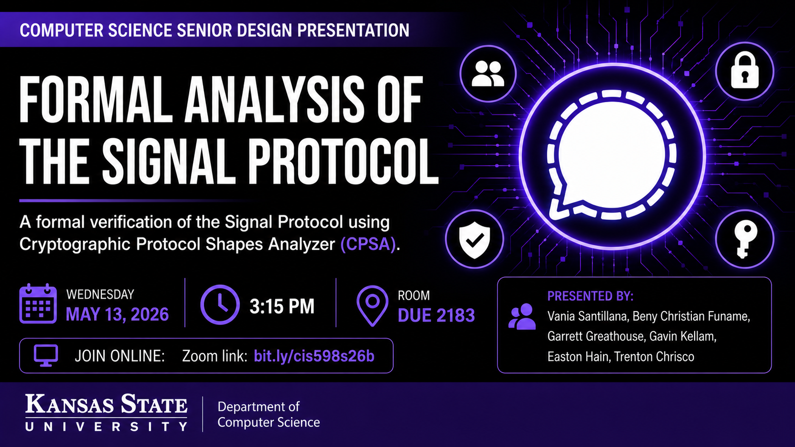

Signal is a messaging application that uses complex cryptographic protocols to provide confidentiality, forward secrecy, post-compromise security, and authentication. This project aims to model the Signal App’s encryption protocol. The Signal application uses a “Double Ratchet Algorithm” to exchange encrypted messages based on a shared secret key. While the technical details are publicly available, its complexity makes informal reasoning about its security properties insufficient. Therefore, formal analysis of the algorithm will be necessary using Cryptographic Protocol Shapes Analyzer (CPSA). 

## Verbum {#e28}

Owen Pearsall

Verbum is an EBNF-to-C parser generator. The goal of Verbum is to generate fast, simple, and readable code that can be easily integrated within the user's own projects (i.e. interpreter, compiler, etc.). The generated code will allow the user to bypass writing code for lexical analysis and abstract syntax tree construction. Verbum is written entirely in C and utilizes various open-source libraries and programs.

## Volant Reader {#e29}

Robby Clausel

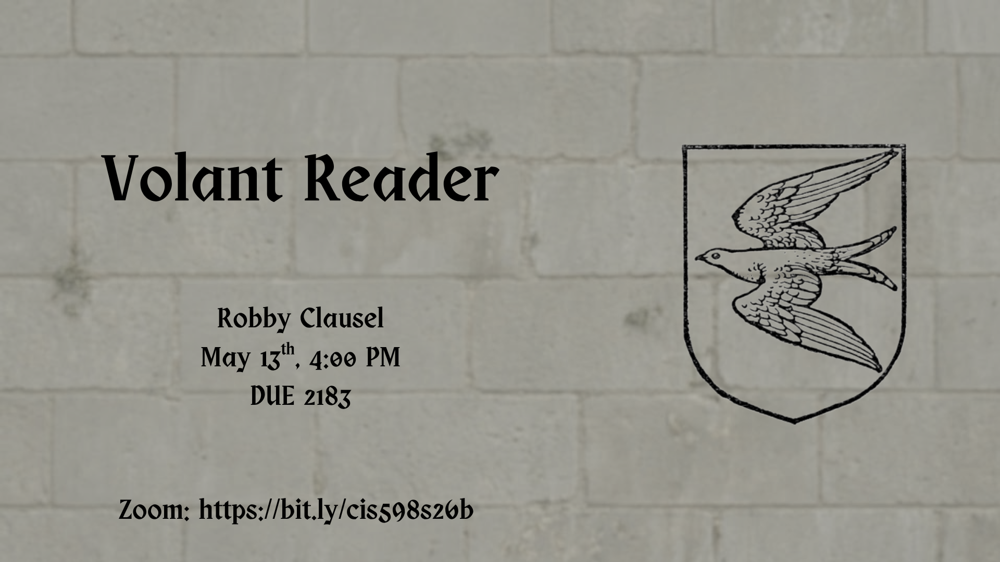

Volant Reader is an ePub Reader app that provides multiple reading modes and reading statistics along with normal eReading features. This app attempts to build on top of common reading apps by adding features to develop and maintain speed-reading skills and tracking reading statistics to show improvement. The app is an android app built using Kotlin with a basic room database to store progress and statistics. Volant Reader will be presented in DUE 2183 on Wednesday, May 13th at 4:00 PM by me, Robby Clausel.

## Shopnow {#e30}

Dean Blickenstaff

Shopnow is a web-app made for retail business owners to easily host an online storefront with a connected inventory.
One business owner can manage multiple groups of stores, each with their own online inventory. Management can upload products and their data including price, images, categories, and sku information. Individual stores can keep track of their separate in-store inventory. Adding items to this in-store inventory makes them available for online order and pickup at that location.

## Cart Pilot {#e31}

Takumi Hendricks

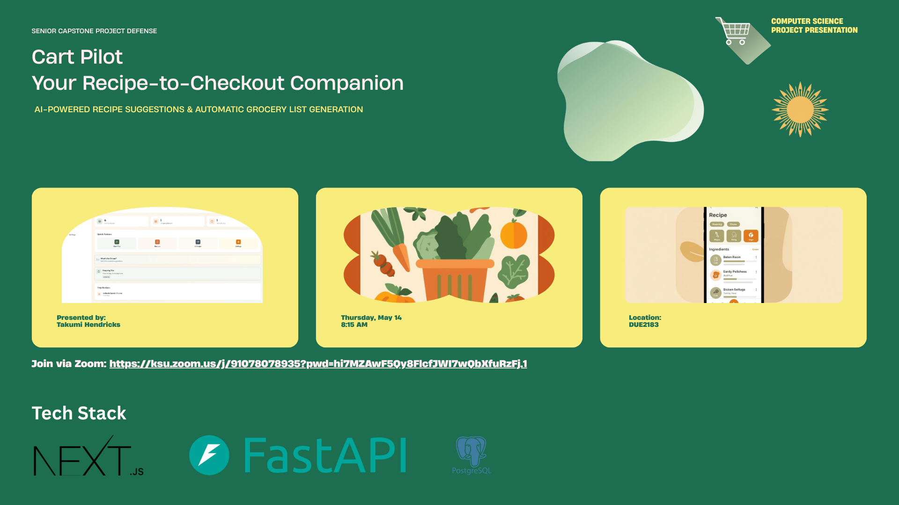

Cart Pilot is a grocery planning app that makes it easier to go from recipes to checkout. Users can add a few recipes, and Cart Pilot automatically creates a grocery list, lets them remove pantry staples they already have, and helps convert the remaining items into a shopping cart at their preferred grocery store. The app also includes AI features that can suggest recipes on the spot and instantly turn them into grocery lists. 

## Interdisciplinary Techniques for Entropy Evaluation {#e32}

Patrick Kehoe, Timothy Larson, Creighton Moes, Nicholas Slinker, Connor Wiedenmann

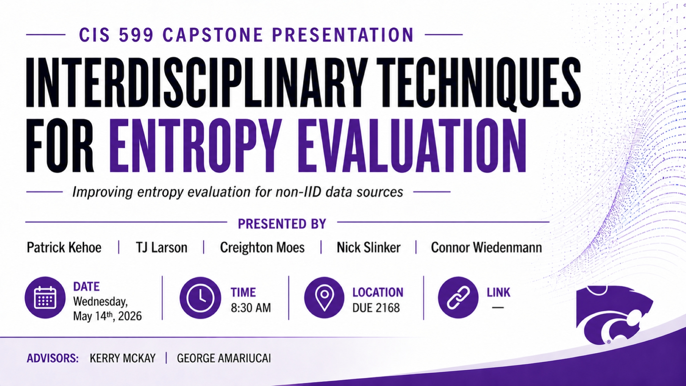

This project explores interdisciplinary techniques for evaluating entropy in non-IID data sources used for cryptographic random bit generation. We extend NIST SP 800-90B Entropy Assessment by integrating adaptive predictive models inspired by the PAQ compression algorithm using a C++ implementation. Our approach adds multiple custom predictors including bitwise, reversed-byte, bias-aware, complement-based, and match-based models to better detect structural patterns and bias that traditional estimators may miss. We processed and analyzed over 1,000 synthetic datasets and compared our predictive results against SP 800-90B min-entropy estimates to evaluate statistical behavior and consistency. The project combines cryptography, compression-based modeling, and statistical validation to investigate whether adaptive prediction can improve entropy evaluation in randomness testing.

## When Water Isn't Save; Health Impacts in Kansas {#e33}

Kylie Phommasack

The study investigates the relationship between boil water alerts and public health indicators across Kansas counties. Access to safe drinking water plays a pivotal role in the health of communities. However, infrastructure and environmental challenges pose risks and can lead to numerous boil water alerts in these communities. Understanding whether these alerts are correlated with social needs and other health factors can help identify the high-risk counties and provide insights and recommendations for these counties. Interested in the results of the study? Head to DUE 2183 on Thursday, May 14 @ 9:00 AM.

## PathFlow {#e34}

Braden Adams

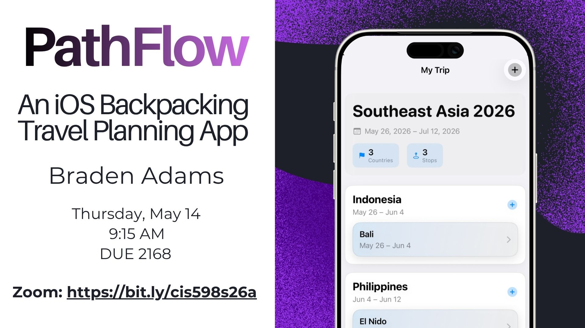

PathFlow is an iOS application consisting of a suite of features for fast-paced, backpack traveling like an itinerary builder, a stop recommendation engine, and a service allowing users to forward their booking confirmation emails to be automatically added to their itinerary. Countries travelling to, stops in each country, as well as transportation and accommodation can all be tracked with ease. Additionally, users can keep up with their travel spending in one spot and view their trip on a map. It is developed using SwiftUI framework, and utilizes both the Firestore and Functions features of Firebase for database storage and hosted services.

## Project Name {#e35}

Corbin Hoppas

Abstract

## Type Learner {#e36}

Cole James

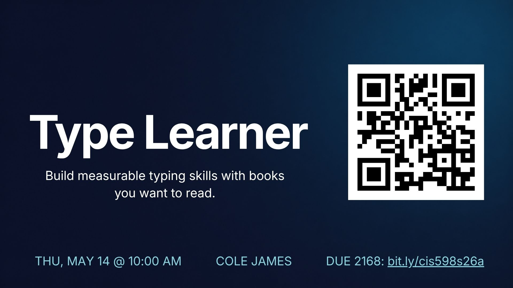

Type Learner, by Cole James, is a reading application that blends the traditional aspects of an e-reader with the typing experience found in many typing games. This application allows users to upload their favorite books and type through them as if they were playing a typing game. Type Learner also provides valuable typing statistics that users can view. These statistics are collected across both books and sessions, enabling users to gain key insights into their typing improvement and progression over time. This application was built using web technologies. The frontend is built using Vue.js. The backend was built on top of Express.js and Node.js. Join the presentation on Thursday, May 14, at 10:00 AM in DUE 2168 or online via Zoom: bit.ly/cis598s26a

## SecureDial {#e37}

Griffin Miller

This project is a call center application built using C# Windows Forms and a server end developed using ASP.NET Core that allows agents to handle and control phone calls. A key feature of this application is the ability for callers to verify their sensitive payment card information using their keypads during the phone call so neither the agent on the call nor anyone around the caller will ever be exposed to the raw payment card data. The system supports call routing, continuous audio streaming, and interactive call control, including muting, holding, and card verification. The application also includes detailed summaries of each phone call, including real-time transcripts of the call using the Vosk speech-to-text engine, as well as a sentiment score based on that transcription using VaderSharp2, a sentiment analysis library, to determine the caller’s attitude during their interaction with the agent. Overall, this project is made to demonstrate a real-time communication system with a secure method of verifying sensitive payment card data in a call center environment.

## Simulating Ethics {#e38}

Riley Reynolds

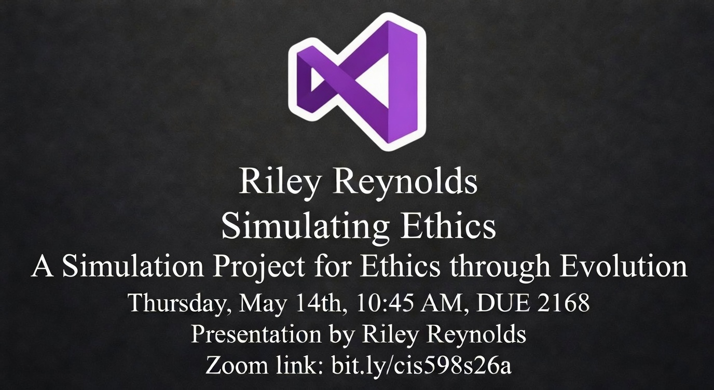

Abstract

## Shooting Guys TD {#e39}

Tate Alfred

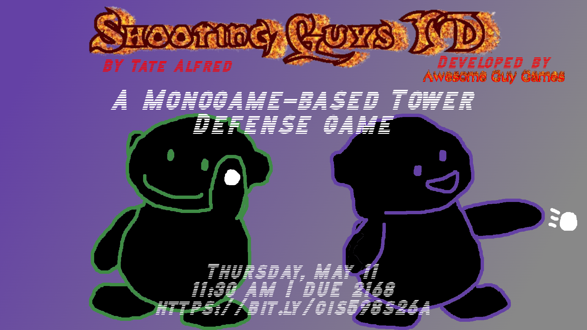

Shooting Guys TD is a Tower Defense Game built in the Monogame framework. Based on the popular Tower Defense Game Bloons TD, Shooting Guys TD aims to build a similar experience with different and unique towers. With modular design in mind, an infinite number of towers and enemies could be at the player's fingertips.

## CIS 598 Dashboard {#e40}

Kasen Fudge

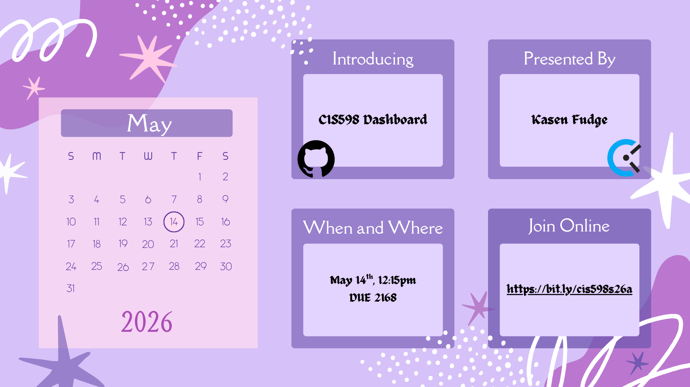

This project streamlines the administrative overhead of Senior Design Projects by automating student progress tracking. By integrating GitHub and Clockify APIs within a Django-based framework, the platform consolidates development activity and time-tracking data into a centralized dashboard. The resulting web application provides faculty with an efficient, transparent, and real-time overview of student progress, replacing manual reporting with automated data collection.

## Dataying Block Programming {#e41}

Nalen Rangarajan

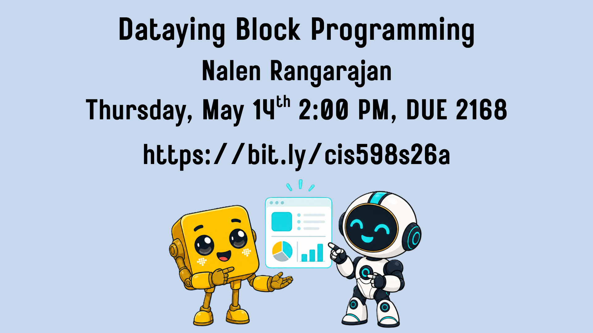

Dataying Block Programming is a web application designed to help introduce young students (ages 4-6) to data science concepts. Students interact with teacher created lessons using drag-and-drop programming styles and teachers can develop in-depth lessons for their students. The platform supports a dynamic lesson creation and interaction system for a variety of lesson possibilities. The web application was developed using Vue, C#, and SQL Server. Dataying Block Programming will be presented by Nalen Rangarajan on Thursday, May 14th at 2:00 PM in DUE 2168, or online at https://bit.ly/cis598s26a.

## Project Name {#e42}

Hasan Hanafieh

Abstract

## Analyzing the Security of the Model Context Protocol for Satellite Communications {#e43}

Sebastian Alturck-Carlos, Calvin Beechner, Jesus Castro-Garcia, Noe Rosales, Jose Varela

This project focuses on analyzing the Model Context Protocol within satellite communication systems. This is done by developing and testing prototype software that connects AI with NASA's Core Flight System (cFS) with MCP. Our team uses Claude as our AI model which communicates with our MCP server (implemented with FastMCP) to send commands to our simulated satellite environment, which we have running on a Ubuntu virtual machine. The goal of our project is to discover and analyze any vulnerabilities and exploits that adversaries may use to manipulate command execution. Our research will allow us to detect risks of AI-assisted satellite operations, impacting real-world aerospace systems. Our presentation is on May 14, at 3:30pm, in DUE 2168.

## H.O.U.S.E.K.E.E.P.E.R {#e44}

Logan Hayward

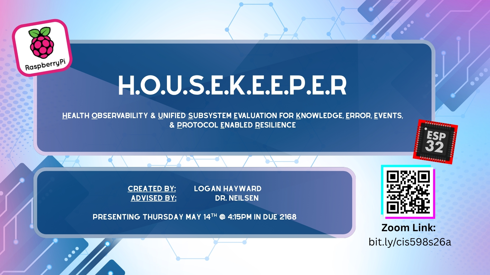

H.O.U.S.E.K.E.E.P.E.R is a hardware simulation platform developed to support flight software development for K-State's CubeSat program. Written in C, the system centers on a Raspberry Pi 5, acting as an I2C controller to ESP32 microcontrollers, which in turn control their own BMP280 sensor. Telemetry is packaged in CCSDS format with CRC16 checksum validation and transmitted over UDP, with autonomous embedded device monitoring, fault detection, and recovery visualized in real time through a React/Node.js web dashboard.